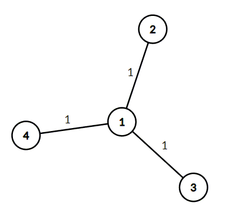
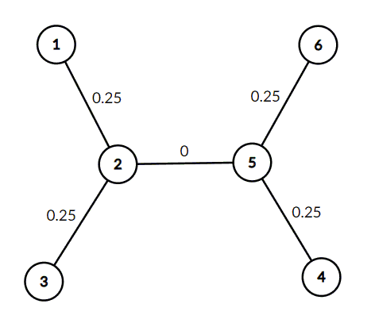

<h1 style='text-align: center;'> D. Minimum Diameter Tree</h1>

<h5 style='text-align: center;'>time limit per test: 1 second</h5>
<h5 style='text-align: center;'>memory limit per test: 256 megabytes</h5>

You are given a tree (an undirected connected graph without cycles) and an integer $s$.

Vanya wants to put weights on all edges of the tree so that all weights are non-negative real numbers and their sum is $s$. At the same time, he wants to make the diameter of the tree as small as possible.

Let's define the diameter of a weighed tree as the maximum sum of the weights of the edges lying on the path between two some vertices of the tree. In other words, the diameter of a weighed tree is the length of the longest simple path in the tree, where length of a path is equal to the sum of weights over all edges in the path.

Find the minimum possible diameter that Vanya can get.

## Input

The first line contains two integer numbers $n$ and $s$ ($2 \leq n \leq 10^5$, $1 \leq s \leq 10^9$) — the number of vertices in the tree and the sum of edge weights.

Each of the following $n−1$ lines contains two space-separated integer numbers $a_i$ and $b_i$ ($1 \leq a_i, b_i \leq n$, $a_i \neq b_i$) — the indexes of vertices connected by an edge. The edges are undirected.

It is guaranteed that the given edges form a tree.

## Output

Print the minimum diameter of the tree that Vanya can get by placing some non-negative real weights on its edges with the sum equal to $s$.

Your answer will be considered correct if its absolute or relative error does not exceed $10^{-6}$.

Formally, let your answer be $a$, and the jury's answer be $b$. Your answer is considered correct if $\frac {|a-b|} {max(1, b)} \leq 10^{-6}$.

## Examples

## Input


```

4 3
1 2
1 3
1 4

```
## Output


```

2.000000000000000000
```
## Input


```

6 1
2 1
2 3
2 5
5 4
5 6

```
## Output


```

0.500000000000000000
```
## Input


```

5 5
1 2
2 3
3 4
3 5

```
## Output


```

3.333333333333333333
```
## Note

In the first example it is necessary to put weights like this:

  It is easy to see that the diameter of this tree is $2$. It can be proved that it is the minimum possible diameter.

In the second example it is necessary to put weights like this:

  

#### tags 

#1700 #constructive_algorithms #implementation #trees 