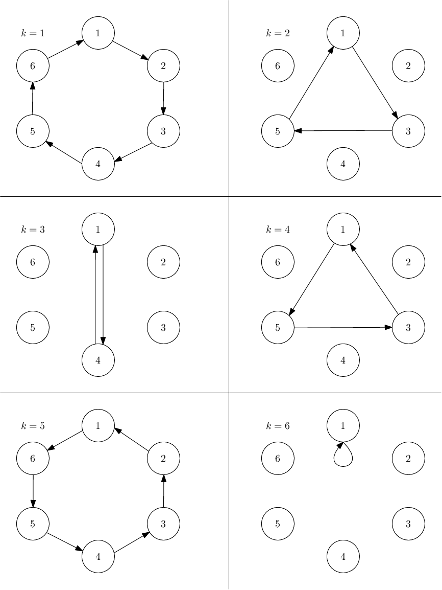

<h1 style='text-align: center;'> C. New Year and the Sphere Transmission</h1>

<h5 style='text-align: center;'>time limit per test: 1 second</h5>
<h5 style='text-align: center;'>memory limit per test: 256 megabytes</h5>

There are $n$ people sitting in a circle, numbered from $1$ to $n$ in the order in which they are seated. That is, for all $i$ from $1$ to $n-1$, the people with id $i$ and $i+1$ are adjacent. People with id $n$ and $1$ are adjacent as well.

The person with id $1$ initially has a ball. He picks a positive integer $k$ at most $n$, and passes the ball to his $k$-th neighbour in the direction of increasing ids, that person passes the ball to his $k$-th neighbour in the same direction, and so on until the person with the id $1$ gets the ball back. When he gets it back, people do not pass the ball any more.

For instance, if $n = 6$ and $k = 4$, the ball is passed in order $[1, 5, 3, 1]$. 

Consider the set of all people that touched the ball. The fun value of the game is the sum of the ids of people that touched it. In the above example, the fun value would be $1 + 5 + 3 = 9$.

Find and report the set of possible fun values for all choices of positive integer $k$. It can be shown that under the constraints of the problem, the ball always gets back to the $1$-st player after finitely many steps, and there are no more than $10^5$ possible fun values for given $n$.

## Input

The only line consists of a single integer $n$ ($2 \leq n \leq 10^9$) — the number of people playing with the ball.

## Output

Suppose the set of all fun values is $f_1, f_2, \dots, f_m$.

## Output

 a single line containing $m$ space separated integers $f_1$ through $f_m$ in increasing order.

## Examples

## Input


```

6

```
## Output


```

1 5 9 21

```
## Input


```

16

```
## Output


```

1 10 28 64 136

```
## Note

In the first sample, we've already shown that picking $k = 4$ yields fun value $9$, as does $k = 2$. Picking $k = 6$ results in fun value of $1$. For $k = 3$ we get fun value $5$ and with $k = 1$ or $k = 5$ we get $21$. 

  In the second sample, the values $1$, $10$, $28$, $64$ and $136$ are achieved for instance for $k = 16$, $8$, $4$, $10$ and $11$, respectively.


#### tags 

#1400 #math #number_theory 