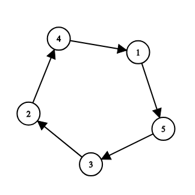

<h1 style='text-align: center;'> D. Circular Dance</h1>

<h5 style='text-align: center;'>time limit per test: 3 seconds</h5>
<h5 style='text-align: center;'>memory limit per test: 256 megabytes</h5>

There are $n$ kids, numbered from $1$ to $n$, dancing in a circle around the Christmas tree. Let's enumerate them in a clockwise direction as $p_1$, $p_2$, ..., $p_n$ (all these numbers are from $1$ to $n$ and are distinct, so $p$ is a permutation). Let the next kid for a kid $p_i$ be kid $p_{i + 1}$ if $i < n$ and $p_1$ otherwise. After the dance, each kid remembered two kids: the next kid (let's call him $x$) and the next kid for $x$. Each kid told you which kids he/she remembered: the kid $i$ remembered kids $a_{i, 1}$ and $a_{i, 2}$. However, the order of $a_{i, 1}$ and $a_{i, 2}$ can differ from their order in the circle.

  Example: 5 kids in a circle, $p=[3, 2, 4, 1, 5]$ (or any cyclic shift). The information kids remembered is: $a_{1,1}=3$, $a_{1,2}=5$; $a_{2,1}=1$, $a_{2,2}=4$; $a_{3,1}=2$, $a_{3,2}=4$; $a_{4,1}=1$, $a_{4,2}=5$; $a_{5,1}=2$, $a_{5,2}=3$. You have to restore the order of the kids in the circle using this information. If there are several answers, you may print any. It is guaranteed that at least one solution exists.

If you are Python programmer, consider using PyPy instead of Python when you submit your code.

## Input

The first line of the input contains one integer $n$ ($3 \le n \le 2 \cdot 10^5$) — the number of the kids.

The next $n$ lines contain $2$ integers each. The $i$-th line contains two integers $a_{i, 1}$ and $a_{i, 2}$ ($1 \le a_{i, 1}, a_{i, 2} \le n, a_{i, 1} \ne a_{i, 2}$) — the kids the $i$-th kid remembered, given in arbitrary order.

## Output

Print $n$ integers $p_1$, $p_2$, ..., $p_n$ — permutation of integers from $1$ to $n$, which corresponds to the order of kids in the circle. If there are several answers, you may print any (for example, it doesn't matter which kid is the first in the circle). It is guaranteed that at least one solution exists.

## Examples

## Input


```

5
3 5
1 4
2 4
1 5
2 3

```
## Output


```

3 2 4 1 5 

```
## Input


```

3
2 3
3 1
1 2

```
## Output


```

3 1 2 

```


#### tags 

#1600 #implementation 