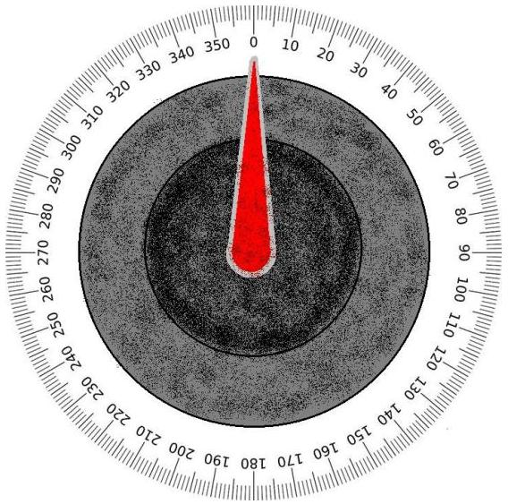

<h1 style='text-align: center;'> B. Petr and a Combination Lock</h1>

<h5 style='text-align: center;'>time limit per test: 1 second</h5>
<h5 style='text-align: center;'>memory limit per test: 256 megabytes</h5>

Petr has just bought a new car. He's just arrived at the most known Petersburg's petrol station to refuel it when he suddenly discovered that the petrol tank is secured with a combination lock! The lock has a scale of $360$ degrees and a pointer which initially points at zero:

  Petr called his car dealer, who instructed him to rotate the lock's wheel exactly $n$ times. The $i$-th rotation should be $a_i$ degrees, either clockwise or counterclockwise, and after all $n$ rotations the pointer should again point at zero.

This confused Petr a little bit as he isn't sure which rotations should be done clockwise and which should be done counterclockwise. As there are many possible ways of rotating the lock, help him and find out whether there exists at least one, such that after all $n$ rotations the pointer will point at zero again.

## Input

The first line contains one integer $n$ ($1 \leq n \leq 15$) — the number of rotations.

Each of the following $n$ lines contains one integer $a_i$ ($1 \leq a_i \leq 180$) — the angle of the $i$-th rotation in degrees.

## Output

If it is possible to do all the rotations so that the pointer will point at zero after all of them are performed, print a single word "YES". Otherwise, print "NO". Petr will probably buy a new car in this case.

You can print each letter in any case (upper or lower).

## Examples

## Input


```

3
10
20
30

```
## Output


```

YES

```
## Input


```

3
10
10
10

```
## Output


```

NO

```
## Input


```

3
120
120
120

```
## Output


```

YES

```
## Note

In the first example, we can achieve our goal by applying the first and the second rotation clockwise, and performing the third rotation counterclockwise.

In the second example, it's impossible to perform the rotations in order to make the pointer point at zero in the end.

In the third example, Petr can do all three rotations clockwise. In this case, the whole wheel will be rotated by $360$ degrees clockwise and the pointer will point at zero again.


#### tags 

#1200 #bitmasks #brute_force #dp 