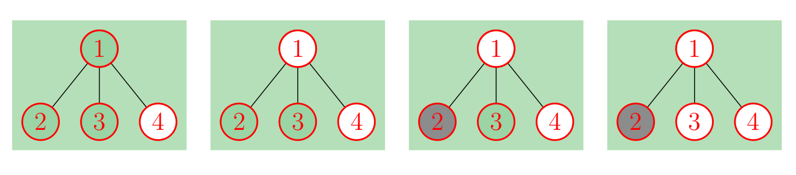

<h1 style='text-align: center;'> G. Tree-Tac-Toe </h1>

<h5 style='text-align: center;'>time limit per test: 3 seconds</h5>
<h5 style='text-align: center;'>memory limit per test: 256 megabytes</h5>

The tic-tac-toe game is starting on a tree of $n$ vertices. Some vertices are already colored in white while the remaining are uncolored.

There are two players — white and black. The players make moves alternatively. The white player starts the game. In his turn, a player must select one uncolored vertex and paint it in his color.

The player wins if he paints some path of three vertices in his color. In case all vertices are colored and neither player won, the game ends in a draw.

Could you please find who will win the game or whether it ends as a draw, assuming both players play optimally? 

## Input

The first line contains a single integer $T$ ($1 \le T \le 50\,000$) — the number of test cases. Then descriptions of $T$ test cases follow.

The first line of each test contains a single integer $n$ ($1 \le n \le 5 \cdot 10^5$) — the number of vertices in the tree.

Each of the following $n - 1$ lines contains integers $v$, $u$ ($1 \le v, u \le n$) denoting an edge of the tree connecting vertices $v$ and $u$.

The last line of a test case contains a string of letters 'W' (for white) and 'N' (for not colored) of length $n$ denoting already colored vertices. Vertexes already colored in white are denoted as 'W'.

It's guaranteed that the given edges form a tree, that there is at least one uncolored vertex and that there is no path of three white vertices.

It's guaranteed that sum of all $n$ among all test cases is at most $5 \cdot 10^5$.

## Output

For every test case, print either "White", "Draw" or "Black", depending on the result of the game.

## Example

## Input


```

2
4
1 2
1 3
1 4
NNNW
5
1 2
2 3
3 4
4 5
NNNNN

```
## Output


```

White
Draw

```
## Note

In the first example, vertex $4$ is already colored in white. The white player can win by coloring the vertex $1$ in white first and the remaining vertex on his second turn. The process is illustrated with the pictures below.

  In the second example, we can show that no player can enforce their victory.


#### tags 

#3100 #constructive_algorithms #games #trees 