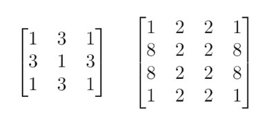

<h1 style='text-align: center;'> C. Palindromic Matrix</h1>

<h5 style='text-align: center;'>time limit per test: 2 seconds</h5>
<h5 style='text-align: center;'>memory limit per test: 256 megabytes</h5>

Let's call some square matrix with integer values in its cells palindromic if it doesn't change after the order of rows is reversed and it doesn't change after the order of columns is reversed.

For example, the following matrices are palindromic:

  The following matrices are not palindromic because they change after the order of rows is reversed:

  The following matrices are not palindromic because they change after the order of columns is reversed:

  You are given $n^2$ integers. Put them into a matrix of $n$ rows and $n$ columns so that each number is used exactly once, each cell contains exactly one number and the resulting matrix is palindromic. If there are multiple answers, print any. If there is no solution, print "NO".

## Input

The first line contains one integer $n$ ($1 \le n \le 20$).

The second line contains $n^2$ integers $a_1, a_2, \dots, a_{n^2}$ ($1 \le a_i \le 1000$) — the numbers to put into a matrix of $n$ rows and $n$ columns.

## Output

If it is possible to put all of the $n^2$ numbers into a matrix of $n$ rows and $n$ columns so that each number is used exactly once, each cell contains exactly one number and the resulting matrix is palindromic, then print "YES". Then print $n$ lines with $n$ space-separated numbers — the resulting matrix.

If it's impossible to construct any matrix, then print "NO".

You can print each letter in any case (upper or lower). For example, "YeS", "no" and "yES" are all acceptable.

## Examples

## Input


```

4
1 8 8 1 2 2 2 2 2 2 2 2 1 8 8 1

```
## Output


```

YES
1 2 2 1
8 2 2 8
8 2 2 8
1 2 2 1

```
## Input


```

3
1 1 1 1 1 3 3 3 3

```
## Output


```

YES
1 3 1
3 1 3
1 3 1

```
## Input


```

4
1 2 1 9 8 4 3 8 8 3 4 8 9 2 1 1

```
## Output


```

NO

```
## Input


```

1
10

```
## Output


```

YES
10 

```
## Note

## Note

 that there exist multiple answers for the first two examples.


#### tags 

#1700 #constructive_algorithms #implementation 