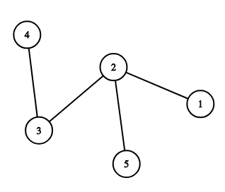

<h1 style='text-align: center;'> E. Legendary Tree</h1>

<h5 style='text-align: center;'>time limit per test: 3 seconds</h5>
<h5 style='text-align: center;'>memory limit per test: 256 megabytes</h5>

This is an interactive problem.

A legendary tree rests deep in the forest. Legend has it that individuals who realize this tree would eternally become a Legendary Grandmaster.

To help you determine the tree, Mikaela the Goddess has revealed to you that the tree contains $n$ vertices, enumerated from $1$ through $n$. She also allows you to ask her some questions as follows. For each question, you should tell Mikaela some two disjoint non-empty sets of vertices $S$ and $T$, along with any vertex $v$ that you like. Then, Mikaela will count and give you the number of pairs of vertices $(s, t)$ where $s \in S$ and $t \in T$ such that the simple path from $s$ to $t$ contains $v$.

Mikaela the Goddess is busy and will be available to answer at most $11\,111$ questions.

This is your only chance. Your task is to determine the tree and report its edges.

## Input

The first line contains an integer $n$ ($2 \leq n \leq 500$) — the number of vertices in the tree.

## Output

When program has realized the tree and is ready to report the edges, print "ANSWER" in a separate line. Make sure that all letters are capitalized.

Then, print $n-1$ lines, each containing two space-separated integers, denoting the vertices that are the endpoints of a certain edge. Each edge should be reported exactly once. Your program should then immediately terminate.

## Interaction

For each question that you wish to ask, interact as follows.

1. First, print the size of $S$ in its own line. In the following line, print $|S|$ space-separated distinct integers, denoting the vertices in $S$.
2. Similarly, print the size of $T$ in its own line. In the following line, print $|T|$ space-separated distinct integers, denoting the vertices in $T$.
3. Then, in the final line, print $v$ — the vertex that you choose for this question.
4. Read Mikaela's answer from input.

Be reminded that $S$ and $T$ must be disjoint and non-empty.

After printing a query do not forget to output end of line and flush the output. Otherwise you will get Idleness limit exceeded. To do this, use:

* fflush(stdout) or cout.flush() in C++;
* System.out.flush() in Java;
* flush(output) in Pascal;
* stdout.flush() in Python;
* see documentation for other languages.

If your program asks too many questions, asks an invalid question or does not correctly follow the interaction guideline above, it may receive an arbitrary verdict. Otherwise, your program will receive the Wrong Answer verdict if it reports an incorrect tree.

## Note

 that the tree is fixed beforehand and does not depend on your queries.

Hacks

Hacks should be formatted as follows.

The first line should contain a single integer $n$ ($2 \leq n \leq 500$) — the number of vertices in the tree.

The following $n-1$ lines should each contain two space-separated integers $u$ and $v$, denoting the existence of an undirected edge $(u, v)$ ($1 \leq u, v \leq n$).

## Example

## Input


```
5  
5  

```
## Output


```
3  
1 2 3  
2  
4 5  
2  
ANSWER  
1 2  
2 3  
3 4  
2 5  

```
## Note

In the sample, the tree is as follows.

  $n = 5$ is given to the program. The program then asks Mikaela a question where $S = \{1, 2, 3\}$, $T = \{4, 5\}$, and $v = 2$, to which she replies with $5$ (the pairs $(s, t)$ are $(1, 4)$, $(1, 5)$, $(2, 4)$, $(2, 5)$, and $(3, 5)$).


#### tags 

#3100 #binary_search #interactive #trees 