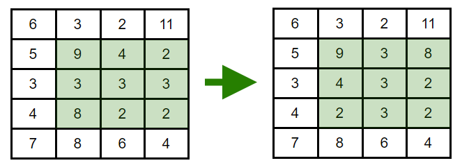

<h1 style='text-align: center;'> C. Nastya Is Transposing Matrices</h1>

<h5 style='text-align: center;'>time limit per test: 1 second</h5>
<h5 style='text-align: center;'>memory limit per test: 256 megabytes</h5>

Nastya came to her informatics lesson, and her teacher who is, by the way, a little bit famous here gave her the following task.

Two matrices $A$ and $B$ are given, each of them has size $n \times m$. Nastya can perform the following operation to matrix $A$ unlimited number of times: 

* take any square square submatrix of $A$ and transpose it (i.e. the element of the submatrix which was in the $i$-th row and $j$-th column of the submatrix will be in the $j$-th row and $i$-th column after transposing, and the transposed submatrix itself will keep its place in the matrix $A$).

Nastya's task is to check whether it is possible to transform the matrix $A$ to the matrix $B$.

  Example of the operation As it may require a lot of operations, you are asked to answer this question for Nastya.

A square submatrix of matrix $M$ is a matrix which consist of all elements which comes from one of the rows with indeces $x, x+1, \dots, x+k-1$ of matrix $M$ and comes from one of the columns with indeces $y, y+1, \dots, y+k-1$ of matrix $M$. $k$ is the size of square submatrix. In other words, square submatrix is the set of elements of source matrix which form a solid square (i.e. without holes).

## Input

The first line contains two integers $n$ and $m$ separated by space ($1 \leq n, m \leq 500$) — the numbers of rows and columns in $A$ and $B$ respectively.

Each of the next $n$ lines contains $m$ integers, the $j$-th number in the $i$-th of these lines denotes the $j$-th element of the $i$-th row of the matrix $A$ ($1 \leq A_{ij} \leq 10^{9}$).

Each of the next $n$ lines contains $m$ integers, the $j$-th number in the $i$-th of these lines denotes the $j$-th element of the $i$-th row of the matrix $B$ ($1 \leq B_{ij} \leq 10^{9}$).

## Output

Print "YES" (without quotes) if it is possible to transform $A$ to $B$ and "NO" (without quotes) otherwise.

You can print each letter in any case (upper or lower).

## Examples

## Input


```

2 2
1 1
6 1
1 6
1 1

```
## Output


```

YES
```
## Input


```

2 2
4 4
4 5
5 4
4 4

```
## Output


```

NO
```
## Input


```

3 3
1 2 3
4 5 6
7 8 9
1 4 7
2 5 6
3 8 9

```
## Output


```

YES
```
## Note

Consider the third example. The matrix $A$ initially looks as follows.

$$ \begin{bmatrix} 1 & 2 & 3\\\ 4 & 5 & 6\\\ 7 & 8 & 9 \end{bmatrix} $$

Then we choose the whole matrix as transposed submatrix and it becomes

$$ \begin{bmatrix} 1 & 4 & 7\\\ 2 & 5 & 8\\\ 3 & 6 & 9 \end{bmatrix} $$

Then we transpose the submatrix with corners in cells $(2, 2)$ and $(3, 3)$. 

$$ \begin{bmatrix} 1 & 4 & 7\\\ 2 & \textbf{5} & \textbf{8}\\\ 3 & \textbf{6} & \textbf{9} \end{bmatrix} $$

So matrix becomes

$$ \begin{bmatrix} 1 & 4 & 7\\\ 2 & 5 & 6\\\ 3 & 8 & 9 \end{bmatrix} $$

and it is $B$.


#### tags 

#1500 #constructive_algorithms #sortings 