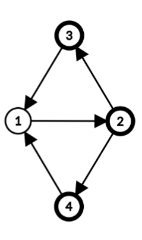
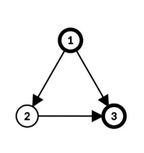

<h1 style='text-align: center;'> C. Museums Tour</h1>

<h5 style='text-align: center;'>time limit per test: 4 seconds</h5>
<h5 style='text-align: center;'>memory limit per test: 512 megabytes</h5>

In the country $N$, there are $n$ cities connected by $m$ one-way roads. Although this country seems unremarkable, there are two interesting facts about it. At first, a week lasts $d$ days here. At second, there is exactly one museum in each city of the country $N$.

Travel agency "Open museums" is developing a new program for tourists interested in museums. Agency's employees know which days each of the museums is open. The tour should start in the capital — the city number $1$, and the first day of the tour must be on the first day of a week. Each day a tourist will be in some city, watching the exposition in its museum (in case museum is open today), and by the end of the day, the tour either ends or the tourist goes into another city connected by a road with the current one. The road system of $N$ is designed in such a way that traveling by a road always takes one night and also all the roads are one-way. It's allowed to visit a city multiple times during the trip.

You should develop such route for the trip that the number of distinct museums, possible to visit during it, is maximum.

## Input

The first line contains three integers $n$, $m$ and $d$ ($1 \leq n \leq 100\,000$, $0 \leq m \leq 100\,000$, $1 \leq d \leq 50$), the number of cities, the number of roads and the number of days in a week.

Each of next $m$ lines contains two integers $u_i$ and $v_i$ ($1 \le u_i, v_i \le n$, $u_i \ne v_i$), denoting a one-way road from the city $u_i$ to the city $v_i$.

The next $n$ lines contain the museums' schedule. The schedule of the museum located in the $i$-th city is described in the $i$-th of these lines. Each line consists of exactly $d$ characters "0" or "1", the $j$-th character of the string equals to "1" if the museum is open at the $j$-th day of a week, and "0", otherwise.

It's guaranteed that for each pair of cities $(u, v)$ there exists no more than one road leading from $u$ to $v$.

## Output

Print a single integer — the maximum number of distinct museums, that it's possible to visit, starting a trip in the first city on the first day of the week.

## Examples

## Input


```

4 5 3
3 1
1 2
2 4
4 1
2 3
011
110
111
001

```
## Output


```

3

```
## Input


```

3 3 7
1 2
1 3
2 3
1111111
0000000
0111111

```
## Output


```

2

```
## Note

 Explanation of the first example  The maximum number of distinct museums to visit is $3$. It's possible to visit $3$ museums, for example, in the way described below.

 

* Day 1. Now it's the 1st day of a week, and the tourist is in the city $1$. The museum there is closed. At night the tourist goes to the city number $2$.
* Day 2. Now it's the 2nd day of a week, and the tourist is in the city $2$. The museum there is open, and the tourist visits it. At night the tourist goes to the city number $4$.
* Day 3. Now it's the 3rd day of a week, and the tourist is in the city $4$. The museum there is open, and the tourist visits it. At night the tourist goes to the city number $1$.
* Day 4. Now it's the 1st day of a week, and the tourist is in the city $1$. The museum there is closed. At night the tourist goes to the city number $2$.
* Day 5. Now it's the 2nd of a week number $2$, and the tourist is in the city $2$. The museum there is open, but the tourist has already visited it. At night the tourist goes to the city number $3$.
* Day 6. Now it's the 3rd day of a week, and the tourist is in the city $3$. The museum there is open, and the tourist visits it. After this, the tour is over.

 Explanation of the second example  The maximum number of distinct museums to visit is $2$. It's possible to visit $2$ museums, for example, in the way described below.

 

* Day 1. Now it's the 1st day of a week, and the tourist is in the city $1$. The museum there is open, and the tourist visits it. At night the tourist goes to the city number $2$.
* Day 2. Now it's the 2nd day of a week, and the tourist is in the city $2$. The museum there is closed. At night the tourist goes to the city number $3$.
* Day 3. Now it's the 3rd day of a week, and the tourist is in the city $3$. The museum there is open, and the tourist visits it. After this, the tour is over.


#### tags 

#2500 #dp #graphs #implementation 