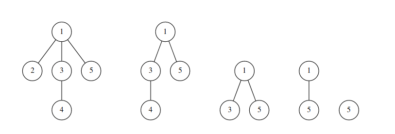

<h1 style='text-align: center;'> F. Matches Are Not a Child's Play </h1>

<h5 style='text-align: center;'>time limit per test: 4 seconds</h5>
<h5 style='text-align: center;'>memory limit per test: 512 megabytes</h5>

Lena is playing with matches. The natural question arising in the head of any child playing with matches is whether it's possible to set a tree on fire with a matches, or not.

Let's say, that the tree is a connected graph without cycles and the vertices are labeled with integers $1, 2, \ldots, n$. Also every vertex $v$ has some integer priority $p_v$ associated with it. All priorities are distinct.

It turns out, that if you set a tree on fire, it will burn to nothing. However, this process doesn't happen instantly. At the beginning, burns out the leaf (a vertex is called to be a leaf if it has only one adjacent vertex) of the tree of the minimum priority. Then burns out the leaf of the minimal priority of the remaining tree, and so on. This way, the vertices turn into the leaves and burn out until only one vertex remains. Then this vertex burns out as well.

Lena has prepared a tree of $n$ vertices and every vertex in it has a priority $p_v = v$. Lena is very curious about burning out this tree. However, she understands, that if she will burn the tree now, then it will disappear completely. Lena is a kind girl and she will feel bad for the burned tree, so she wants to study the process of burning the tree only in her mind. Lena wants to process $q$ queries, each of them is one of three following types:

* "up $v$", assign the vertex $v$ priority $1 + \max\{p_1, p_2, \ldots, p_n\}$;
* "when $v$", find the step at which the vertex $v$ will burn out, if the tree would be set on fire now;
* "compare $v$ $u$", find out which of the vertices $v$ and $u$ will burn out first, if the tree would be set on fire now.

Notice, that if all priorities would be distinct, then after the "up" query they will stay distinct as well. Initially all priorities are distinct, hence during any (purely hypothetical of course) burning of the tree, all leafs would have distinct priorities.

## Input

The first line contains two integers $n$ and $q$ ($2 \le n \le 200\,000$, $1 \le q \le 200\,000$) — the number of vertices in the tree and the number of queries.

The $i$-th of the following $n - 1$ lines contains two integers $v_i$, $u_i$ ($1 \le v_i, u_i \le n$), denoting the endpoints of the $i$-th edge.

Each of the remaining $q$ lines contains a query of one of the following three types:

* "up $v$" ($1 \le v \le n$) — change the priority of vertex $v$;
* "when $v$" ($1 \le v \le n$) — determine the step at which the vertex $v$ will burn out;
* "compare $v$ $u$" ($1 \le v, u \le n$, $v \ne u$) — determine which of vertices $v$ and $u$ will burn out earlier in the current tree.

It's guaranteed, that there is at least one query of type "when" or "compare".

## Output

For every query of type "when" print one integer in range from $1$ to $n$ — the step at which the vertex $v$ will burn out.

For every query of type "compare" print either $v$ or $u$, depending on which one will burn out earlier.

## Examples

## Input


```

5 7
1 5
1 2
1 3
4 3
when 1
when 2
when 3
when 4
when 5
compare 2 3
compare 3 4

```
## Output


```

4
1
3
2
5
2
4

```
## Input


```

5 5
1 5
1 2
1 3
4 3
up 1
compare 2 4
compare 4 3
compare 3 1
compare 1 5

```
## Output


```

2
4
3
5

```
## Note

In the first example, the process of burning of the tree is illustrated on the following picture:

  In particular, the vertices of the tree will burn out in the following order: $[2, 4, 3, 1, 5]$.

In the second example, after applying the "up" operation, the order of vertices will change to: $[2, 4, 3, 5, 1]$.


#### tags 

#3400 #data_structures #trees 