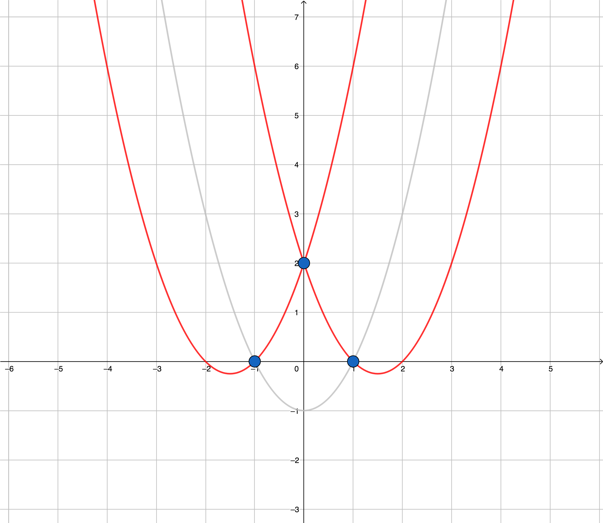
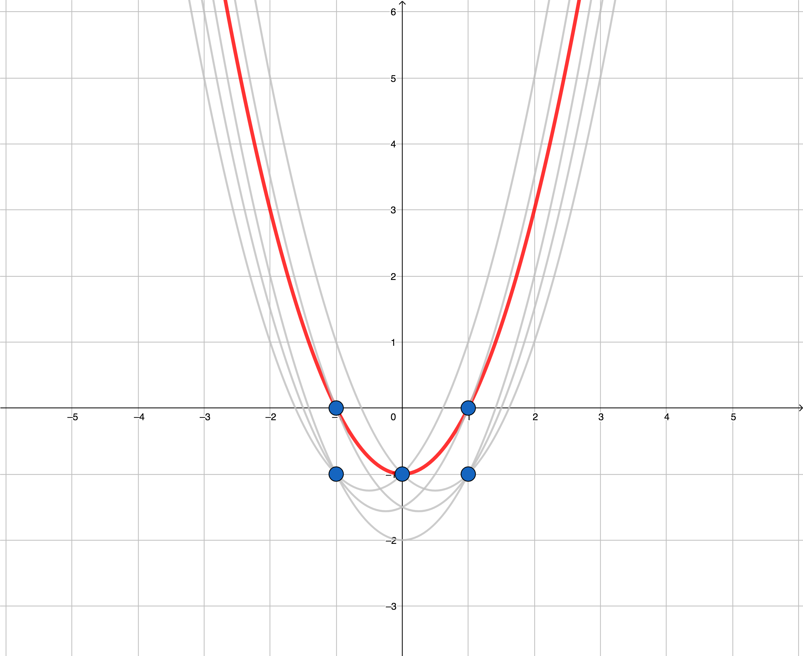

<h1 style='text-align: center;'> C. U2</h1>

<h5 style='text-align: center;'>time limit per test: 1 second</h5>
<h5 style='text-align: center;'>memory limit per test: 256 megabytes</h5>

Recently Vasya learned that, given two points with different $x$ coordinates, you can draw through them exactly one parabola with equation of type $y = x^2 + bx + c$, where $b$ and $c$ are reals. Let's call such a parabola an $U$-shaped one.

Vasya drew several distinct points with integer coordinates on a plane and then drew an $U$-shaped parabola through each pair of the points that have different $x$ coordinates. The picture became somewhat messy, but Vasya still wants to count how many of the parabolas drawn don't have any drawn point inside their internal area. Help Vasya.

The internal area of an $U$-shaped parabola is the part of the plane that lies strictly above the parabola when the $y$ axis is directed upwards.

## Input

The first line contains a single integer $n$ ($1 \le n \le 100\,000$) — the number of points.

The next $n$ lines describe the points, the $i$-th of them contains two integers $x_i$ and $y_i$ — the coordinates of the $i$-th point. It is guaranteed that all points are distinct and that the coordinates do not exceed $10^6$ by absolute value.

## Output

In the only line print a single integer — the number of $U$-shaped parabolas that pass through at least two of the given points and do not contain any of the given points inside their internal area (excluding the parabola itself).

## Examples

## Input


```

3
-1 0
0 2
1 0

```
## Output


```

2

```
## Input


```

5
1 0
1 -1
0 -1
-1 0
-1 -1

```
## Output


```

1

```
## Note

On the pictures below all $U$-shaped parabolas that pass through at least two given points are drawn for each of the examples. The $U$-shaped parabolas that do not have any given point inside their internal area are drawn in red. 

  The first example.   The second example. 

#### tags 

#2400 #geometry 