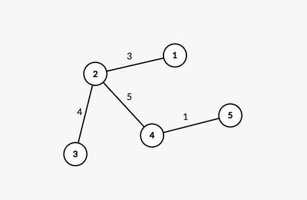

<h1 style='text-align: center;'> C. Tree Diameter</h1>

<h5 style='text-align: center;'>time limit per test: 4 seconds</h5>
<h5 style='text-align: center;'>memory limit per test: 256 megabytes</h5>

There is a weighted tree with $n$ nodes and $n-1$ edges. The nodes are conveniently labeled from $1$ to $n$. The weights are positive integers at most $100$. Define the distance between two nodes to be the sum of edges on the unique path between the nodes. You would like to find the diameter of the tree. Diameter is the maximum distance between a pair of nodes.

Unfortunately, the tree isn't given to you, but you can ask some questions about it. In one question, you can specify two nonempty disjoint sets of nodes $p$ and $q$, and the judge will return the maximum distance between a node in $p$ and a node in $q$. In the words, maximum distance between $x$ and $y$, where $x \in p$ and $y \in q$. After asking not more than $9$ questions, you must report the maximum distance between any pair of nodes.

## Interaction

Each test contains multiple test cases. The first line contains the number of test cases $t$ ($1 \le t \le 1\,000$). Description of the test cases follows.

The first line of each test case contains an integer $n$ ($2 \leq n \leq 100$) — the number of nodes in the tree.

To ask a question, print "$k_1\ k_2\ a_1\ a_2\ \ldots\ a_{k_1}\ b_1\ b_2\ \ldots\ b_{k_2}$" $(k_1, k_2 \geq 1$ and $k_1+k_2 \leq n$). These two sets must be nonempty and disjoint. The judge will respond with a single integer $\max_{p,q} dist(a_p, b_q)$. If you ever get a result of $-1$ (because you printed an invalid query), exit immediately to avoid getting other verdicts.

After printing a query do not forget to output end of line and flush the output. Otherwise, you will get Idleness limit exceeded. To do this, use:

* fflush(stdout) or cout.flush() in C++;
* System.out.flush() in Java;
* flush(output) in Pascal;
* stdout.flush() in Python;
* see documentation for other languages.

When you are ready to answer, print "$-1\ d$", where $d$ is the maximum shortest distance over all pairs of nodes.

You can only ask at most $9$ questions per test case.

Hack Format

To hack, use the following format. ## Note

 that you can only hack with one test case.

The first line should contain a single integer $t$ ($t=1$).

The second line should contain a single integer $n$ ($2 \leq n \leq 100$).

Each of the next $n-1$ lines should contain three integers $a_i, b_i, c_i$ ($1\leq a_i, b_i\leq n$, $1 \leq c_i \leq 100$). This denotes an undirected edge between nodes $a_i$ and $b_i$ with weight $c_i$. These edges must form a tree.

## Example

Input
```

2
5
9
6
10
9
10
2
99

```
Output
```

1 4 1 2 3 4 5
1 4 2 3 4 5 1
1 4 3 4 5 1 2
1 4 4 5 1 2 3
1 4 5 1 2 3 4
-1 10
1 1 1 2
-1 99
```
## Note

In the first example, the first tree looks as follows: 

In the first question, we have $p = {1}$, and $q = {2, 3, 4, 5}$. The maximum distance between a node in $p$ and a node in $q$ is $9$ (the distance between nodes $1$ and $5$).

The second tree is a tree with two nodes with an edge with weight $99$ between them.


#### tags 

#1700 #bitmasks #graphs #interactive 