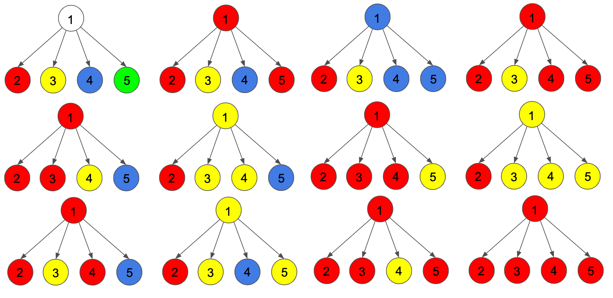

<h1 style='text-align: center;'> F. Leaf Partition</h1>

<h5 style='text-align: center;'>time limit per test: 1 second</h5>
<h5 style='text-align: center;'>memory limit per test: 256 megabytes</h5>

You are given a rooted tree with $n$ nodes, labeled from $1$ to $n$. The tree is rooted at node $1$. The parent of the $i$-th node is $p_i$. A leaf is node with no children. For a given set of leaves $L$, let $f(L)$ denote the smallest connected subgraph that contains all leaves $L$.

You would like to partition the leaves such that for any two different sets $x, y$ of the partition, $f(x)$ and $f(y)$ are disjoint. 

Count the number of ways to partition the leaves, modulo $998244353$. Two ways are different if there are two leaves such that they are in the same set in one way but in different sets in the other.

## Input

The first line contains an integer $n$ ($2 \leq n \leq 200\,000$) — the number of nodes in the tree.

The next line contains $n-1$ integers $p_2, p_3, \ldots, p_n$ ($1 \leq p_i < i$). 

## Output

Print a single integer, the number of ways to partition the leaves, modulo $998244353$.

## Examples

## Input


```

5
1 1 1 1

```
## Output


```

12

```
## Input


```

10
1 2 3 4 5 6 7 8 9

```
## Output


```

1

```
## Note

In the first example, the leaf nodes are $2,3,4,5$. The ways to partition the leaves are in the following image 

In the second example, the only leaf is node $10$ so there is only one partition. ## Note

 that node $1$ is not a leaf.


#### tags 

#2500 #dp #trees 