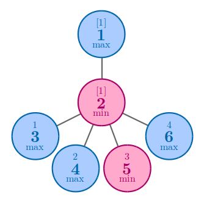
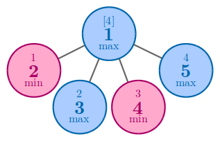
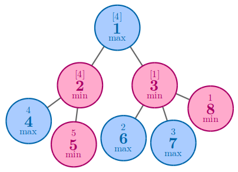
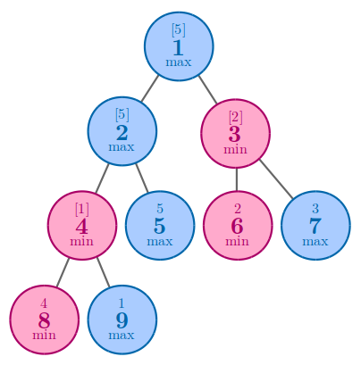

<h1 style='text-align: center;'> D. Serval and Rooted Tree</h1>

<h5 style='text-align: center;'>time limit per test: 2 seconds</h5>
<h5 style='text-align: center;'>memory limit per test: 256 megabytes</h5>

Now Serval is a junior high school student in Japari Middle School, and he is still thrilled on math as before. 

As a talented boy in mathematics, he likes to play with numbers. This time, he wants to play with numbers on a rooted tree.

A tree is a connected graph without cycles. A rooted tree has a special vertex called the root. A parent of a node $v$ is the last different from $v$ vertex on the path from the root to the vertex $v$. Children of vertex $v$ are all nodes for which $v$ is the parent. A vertex is a leaf if it has no children.

The rooted tree Serval owns has $n$ nodes, node $1$ is the root. Serval will write some numbers into all nodes of the tree. However, there are some restrictions. Each of the nodes except leaves has an operation $\max$ or $\min$ written in it, indicating that the number in this node should be equal to the maximum or minimum of all the numbers in its sons, respectively. 

Assume that there are $k$ leaves in the tree. Serval wants to put integers $1, 2, \ldots, k$ to the $k$ leaves (each number should be used exactly once). He loves large numbers, so he wants to maximize the number in the root. As his best friend, can you help him?

## Input

The first line contains an integer $n$ ($2 \leq n \leq 3\cdot 10^5$), the size of the tree.

The second line contains $n$ integers, the $i$-th of them represents the operation in the node $i$. $0$ represents $\min$ and $1$ represents $\max$. If the node is a leaf, there is still a number of $0$ or $1$, but you can ignore it.

The third line contains $n-1$ integers $f_2, f_3, \ldots, f_n$ ($1 \leq f_i \leq i-1$), where $f_i$ represents the parent of the node $i$.

## Output

## Output

 one integer — the maximum possible number in the root of the tree.

## Examples

## Input


```

6
1 0 1 1 0 1
1 2 2 2 2

```
## Output


```

1

```
## Input


```

5
1 0 1 0 1
1 1 1 1

```
## Output


```

4

```
## Input


```

8
1 0 0 1 0 1 1 0
1 1 2 2 3 3 3

```
## Output


```

4

```
## Input


```

9
1 1 0 0 1 0 1 0 1
1 1 2 2 3 3 4 4

```
## Output


```

5

```
## Note

Pictures below explain the examples. The numbers written in the middle of the nodes are their indices, and the numbers written on the top are the numbers written in the nodes.

In the first example, no matter how you arrange the numbers, the answer is $1$.

  In the second example, no matter how you arrange the numbers, the answer is $4$.

  In the third example, one of the best solution to achieve $4$ is to arrange $4$ and $5$ to nodes $4$ and $5$.

  In the fourth example, the best solution is to arrange $5$ to node $5$.

  

#### tags 

#1900 #binary_search #dfs_and_similar #dp #greedy #trees 