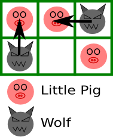

<h1 style='text-align: center;'> B. Little Pigs and Wolves</h1>

<h5 style='text-align: center;'>time limit per test: 2 seconds</h5>
<h5 style='text-align: center;'>memory limit per test: 256 megabytes</h5>

Once upon a time there were several little pigs and several wolves on a two-dimensional grid of size *n* × *m*. Each cell in this grid was either empty, containing one little pig, or containing one wolf.

A little pig and a wolf are adjacent if the cells that they are located at share a side. The little pigs are afraid of wolves, so there will be at most one wolf adjacent to each little pig. But each wolf may be adjacent to any number of little pigs.

They have been living peacefully for several years. But today the wolves got hungry. One by one, each wolf will choose one of the little pigs adjacent to it (if any), and eats the poor little pig. This process is not repeated. That is, each wolf will get to eat at most one little pig. Once a little pig gets eaten, it disappears and cannot be eaten by any other wolf.

What is the maximum number of little pigs that may be eaten by the wolves?

## Input

The first line contains integers *n* and *m* (1 ≤ *n*, *m* ≤ 10) which denotes the number of rows and columns in our two-dimensional grid, respectively. Then follow *n* lines containing *m* characters each — that is the grid description. "." means that this cell is empty. "P" means that this cell contains a little pig. "W" means that this cell contains a wolf. 

It is guaranteed that there will be at most one wolf adjacent to any little pig.

## Output

Print a single number — the maximal number of little pigs that may be eaten by the wolves.

## Examples

## Input


```
2 3  
PPW  
W.P  

```
## Output


```
2  

```
## Input


```
3 3  
P.W  
.P.  
W.P  

```
## Output


```
0  

```
## Note

In the first example, one possible scenario in which two little pigs get eaten by the wolves is as follows. 

  

#### tags 

#1100 #greedy #implementation 