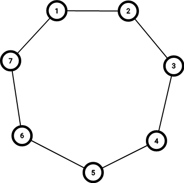
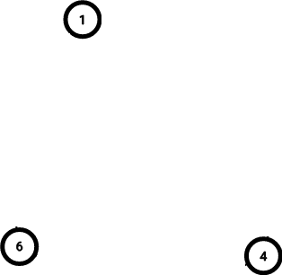
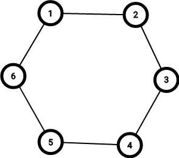
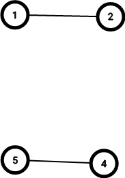

<h1 style='text-align: center;'> A. Eating Soup</h1>

<h5 style='text-align: center;'>time limit per test: 1 second</h5>
<h5 style='text-align: center;'>memory limit per test: 256 megabytes</h5>

The three friends, Kuro, Shiro, and Katie, met up again! It's time for a party...

What the cats do when they unite? Right, they have a party. Since they wanted to have as much fun as possible, they invited all their friends. Now $n$ cats are at the party, sitting in a circle and eating soup. The rules are simple: anyone having finished their soup leaves the circle.

Katie suddenly notices that whenever a cat leaves, the place where she was sitting becomes an empty space, which means the circle is divided into smaller continuous groups of cats sitting next to each other. At the moment Katie observes, there are $m$ cats who left the circle. This raises a question for Katie: what is the maximum possible number of groups the circle is divided into at the moment?

Could you help her with this curiosity?

You can see the examples and their descriptions with pictures in the "## Note

" section.

## Input

The only line contains two integers $n$ and $m$ ($2 \leq n \leq 1000$, $0 \leq m \leq n$) — the initial number of cats at the party and the number of cats who left the circle at the moment Katie observes, respectively.

## Output

Print a single integer — the maximum number of groups of cats at the moment Katie observes.

## Examples

## Input


```

7 4

```
## Output


```

3

```
## Input


```

6 2

```
## Output


```

2

```
## Input


```

3 0

```
## Output


```

1

```
## Input


```

2 2

```
## Output


```

0

```
## Note

In the first example, originally there are $7$ cats sitting as shown below, creating a single group:

  At the observed moment, $4$ cats have left the table. Suppose the cats $2$, $3$, $5$ and $7$ have left, then there are $3$ groups remaining. It is possible to show that it is the maximum possible number of groups remaining.

  In the second example, there are $6$ cats sitting as shown below:

  At the observed moment, $2$ cats have left the table. Suppose the cats numbered $3$ and $6$ left, then there will be $2$ groups remaining ($\{1, 2\}$ and $\{4, 5\}$). It is impossible to have more than $2$ groups of cats remaining.

  In the third example, no cats have left, so there is $1$ group consisting of all cats.

In the fourth example, all cats have left the circle, so there are $0$ groups.


#### tags 

#900 #greedy #math 