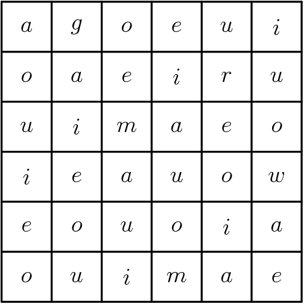

<h1 style='text-align: center;'> B. All the Vowels Please</h1>

<h5 style='text-align: center;'>time limit per test: 1 second</h5>
<h5 style='text-align: center;'>memory limit per test: 256 megabytes</h5>

Tom loves vowels, and he likes long words with many vowels. His favorite words are vowelly words. We say a word of length $k$ is vowelly if there are positive integers $n$ and $m$ such that $n\cdot m = k$ and when the word is written by using $n$ rows and $m$ columns (the first row is filled first, then the second and so on, with each row filled from left to right), every vowel of the English alphabet appears at least once in every row and every column.

You are given an integer $k$ and you must either print a vowelly word of length $k$ or print $-1$ if no such word exists.

In this problem the vowels of the English alphabet are 'a', 'e', 'i', 'o' ,'u'.

## Input

## Input

 consists of a single line containing the integer $k$ ($1\leq k \leq 10^4$) — the required length.

## Output

The output must consist of a single line, consisting of a vowelly word of length $k$ consisting of lowercase English letters if it exists or $-1$ if it does not.

If there are multiple possible words, you may output any of them.

## Examples

## Input


```

7

```
## Output


```

-1

```
## Input


```

36

```
## Output


```

agoeuioaeiruuimaeoieauoweouoiaouimae
```
## Note

In the second example, the word "agoeuioaeiruuimaeoieauoweouoiaouimae" can be arranged into the following $6 \times 6$ grid:

  It is easy to verify that every row and every column contain all the vowels.


#### tags 

#1100 #constructive_algorithms #math #number_theory 