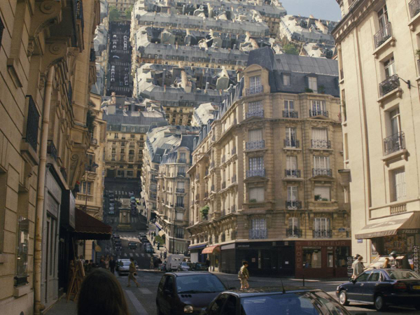
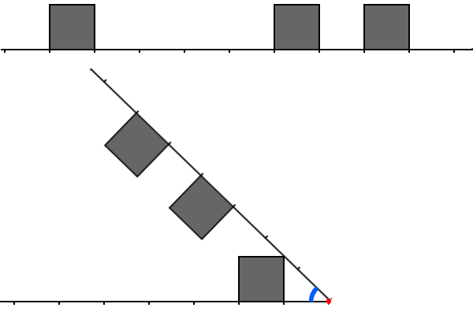

<h1 style='text-align: center;'> G. Low Budget Inception</h1>

<h5 style='text-align: center;'>time limit per test: 3 seconds</h5>
<h5 style='text-align: center;'>memory limit per test: 256 megabytes</h5>

So we got bored and decided to take our own guess at how would "Inception" production go if the budget for the film had been terribly low.

The first scene we remembered was the one that features the whole city bending onto itself:

  It feels like it will require high CGI expenses, doesn't it? Luckily, we came up with a similar-looking scene which was a tiny bit cheaper to make.

Firstly, forget about 3D, that's hard and expensive! The city is now represented as a number line (infinite to make it easier, of course).

Secondly, the city doesn't have to look natural at all. There are $n$ buildings on the line. Each building is a square $1 \times 1$. Buildings are numbered from $1$ to $n$ in ascending order of their positions. Lower corners of building $i$ are at integer points $a_i$ and $a_i + 1$ of the number line. Also the distance between any two neighbouring buildings $i$ and $i + 1$ doesn't exceed $d$ (really, this condition is here just to make the city look not that sparse). Distance between some neighbouring buildings $i$ and $i + 1$ is calculated from the lower right corner of building $i$ to the lower left corner of building $i + 1$.

Finally, curvature of the bend is also really hard to simulate! Let the bend at some integer coordinate $x$ be performed with the following algorithm. Take the ray from $x$ to $+\infty$ and all the buildings which are on this ray and start turning the ray and the buildings counter-clockwise around point $x$. At some angle some building will touch either another building or a part of the line. You have to stop bending there (implementing buildings crushing is also not worth its money). 

Let's call the angle between two rays in the final state the terminal angle $\alpha_x$.

The only thing left is to decide what integer point $x$ is the best to start bending around. Fortunately, we've already chosen $m$ candidates to perform the bending.

So, can you please help us to calculate terminal angle $\alpha_x$ for each bend $x$ from our list of candidates?

## Input

The first line contains two integer numbers $n$ and $d$ ($1 \le n \le 2 \cdot 10^5$, $0 \le d \le 7000$) — the number of buildings and the maximum distance between any pair of neighbouring buildings, respectively.

The second line contains $n$ integers $a_1, a_2, \dots, a_n$ ($a_1 = 0$, $0 < a_{i + 1} - a_i \le d + 1$) — coordinates of left corners of corresponding buildings in ascending order.

The third line contains single integer $m$ ($1 \le m \le 2 \cdot 10^5$) — the number of candidates.

The fourth line contains $m$ integers $x_1, x_2, \dots, x_m$ ($0 \le x_i \le a_n + 1$, $x_i < x_{i + 1}$) — the coordinates of bends you need to calculate terminal angles for in ascending order.

## Output

Print $m$ numbers. For each bend $x_i$ print terminal angle $\alpha_{x_i}$ (in radians).

Your answer is considered correct if its absolute error does not exceed $10^{-9}$.

Formally, let your answer be $a$, and the jury's answer be $b$. Your answer is accepted if and only if $|a - b| \le 10^{-9}$.

## Examples

## Input


```

3 5
0 5 7
9
0 1 2 3 4 5 6 7 8

```
## Output


```

1.570796326794897
1.570796326794897
0.785398163397448
0.927295218001612
0.785398163397448
1.570796326794897
1.570796326794897
1.570796326794897
1.570796326794897

```
## Input


```

2 7
0 4
3
1 3 4

```
## Output


```

1.570796326794897
0.927295218001612
1.570796326794897

```
## Input


```

5 0
0 1 2 3 4
6
0 1 2 3 4 5

```
## Output


```

1.570796326794897
3.141592653589793
3.141592653589793
3.141592653589793
3.141592653589793
1.570796326794897

```
## Note

Here you can see the picture of the city for the first example and the bend at position $2$ for it. The angle you need to measure is marked blue. You can see that it's equal to $\frac \pi 4$.

You can see that no pair of neighbouring buildings have distance more than $4$ between them. $d = 4$ would also suffice for that test.

  

#### tags 

#3100 #brute_force #geometry 