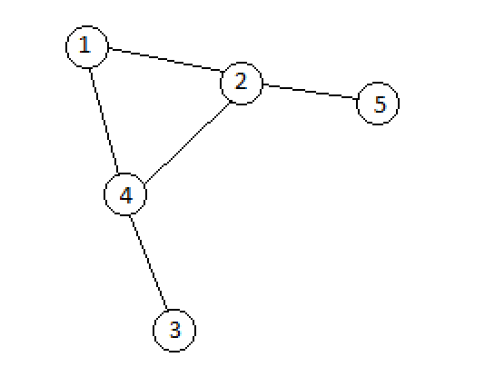
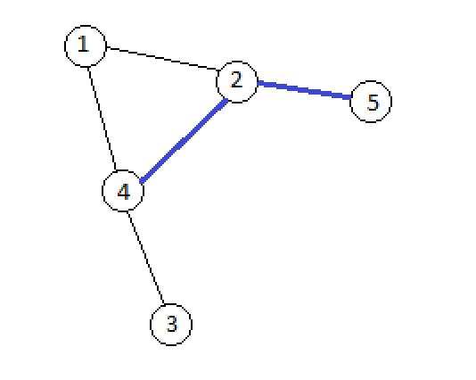
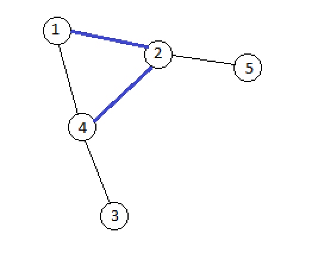

<h1 style='text-align: center;'> E. Tree or not Tree</h1>

<h5 style='text-align: center;'>time limit per test: 5 seconds</h5>
<h5 style='text-align: center;'>memory limit per test: 256 megabytes</h5>

You are given an undirected connected graph *G* consisting of *n* vertexes and *n* edges. *G* contains no self-loops or multiple edges. Let each edge has two states: on and off. Initially all edges are switched off.

You are also given *m* queries represented as (*v*, *u*) — change the state of all edges on the shortest path from vertex *v* to vertex *u* in graph *G*. If there are several such paths, the lexicographically minimal one is chosen. More formally, let us consider all shortest paths from vertex *v* to vertex *u* as the sequences of vertexes *v*, *v*1, *v*2, ..., *u*. Among such sequences we choose the lexicographically minimal one.

After each query you should tell how many connected components has the graph whose vertexes coincide with the vertexes of graph *G* and edges coincide with the switched on edges of graph *G*.

## Input

The first line contains two integers *n* and *m* (3 ≤ *n* ≤ 105, 1 ≤ *m* ≤ 105). Then *n* lines describe the graph edges as *a* *b* (1 ≤ *a*, *b* ≤ *n*). Next *m* lines contain the queries as *v* *u* (1 ≤ *v*, *u* ≤ *n*). 

It is guaranteed that the graph is connected, does not have any self-loops or multiple edges.

## Output

Print *m* lines, each containing one integer — the query results.

## Examples

## Input


```
5 2  
2 1  
4 3  
2 4  
2 5  
4 1  
5 4  
1 5  

```
## Output


```
3  
3  

```
## Input


```
6 2  
4 6  
4 3  
1 2  
6 5  
1 5  
1 4  
2 5  
2 6  

```
## Output


```
4  
3  

```
## Note

Let's consider the first sample. We'll highlight the switched on edges blue on the image. 

* The graph before applying any operations. No graph edges are switched on, that's why there initially are 5 connected components. 

 
* The graph after query *v* = 5, *u* = 4. We can see that the graph has three components if we only consider the switched on edges. 

 
* The graph after query *v* = 1, *u* = 5. We can see that the graph has three components if we only consider the switched on edges. 

 

Lexicographical comparison of two sequences of equal length of *k* numbers should be done as follows. Sequence *x* is lexicographically less than sequence *y* if exists such *i* (1 ≤ *i* ≤ *k*), so that *x**i* < *y**i*, and for any *j* (1 ≤ *j* < *i*) *x**j* = *y**j*.


#### tags 

#2900 #data_structures #divide_and_conquer #implementation #trees 