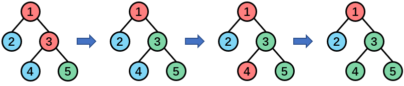
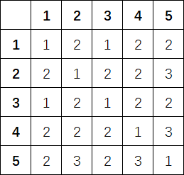

<h1 style='text-align: center;'> E. Nauuo and ODT</h1>

<h5 style='text-align: center;'>time limit per test: 7.5 seconds</h5>
<h5 style='text-align: center;'>memory limit per test: 512 megabytes</h5>

Nauuo is a girl who loves traveling.

One day she went to a tree, Old Driver Tree, literally, a tree with an old driver on it.

The tree is a connected graph consisting of $n$ nodes and $n-1$ edges. Each node has a color, and Nauuo will visit the ODT through a simple path on the tree in the old driver's car.

Nauuo wants to visit see more different colors in her journey, but she doesn't know which simple path she will be traveling on. So, she wants to calculate the sum of the numbers of different colors on all different paths. Can you help her?

What's more, the ODT is being redecorated, so there will be $m$ modifications, each modification will change a single node's color. Nauuo wants to know the answer after each modification too.

## Note

 that in this problem, we consider the simple path from $u$ to $v$ and the simple path from $v$ to $u$ as two different simple paths if and only if $u\ne v$.

## Input

The first line contains two integers $n$ and $m$ ($2\le n\le 4\cdot 10^5$, $1\le m\le 4\cdot 10^5$) — the number of nodes and the number of modifications.

The second line contains $n$ integers $c_1,c_2,\ldots,c_n$ ($1\le c_i\le n$), where $c_i$ is the initial color of node $i$.

Each of the next $n-1$ lines contains two integers $u$ and $v$ ($1\le u,v\le n$), denoting there is an edge between $u$ and $v$. It is guaranteed that the given edges form a tree.

Each of the next $m$ lines contains two integers $u$ and $x$ ($1\le u,x\le n$), which means a modification that changes the color of node $u$ into $x$.

## Output

The output contains $m+1$ integers — the first integer is the answer at the beginning, the rest integers are the answers after every modification in the given order.

## Examples

## Input


```

5 3
1 2 1 2 3
1 2
1 3
3 4
3 5
3 3
4 1
4 3

```
## Output


```

47
51
49
45

```
## Input


```

6 1
1 1 1 1 1 1
1 2
2 3
3 4
4 5
5 6
1 2

```
## Output


```

36
46

```
## Note

Example 1



The number of colors on each simple path at the beginning:




#### tags 

#3300 #data_structures 