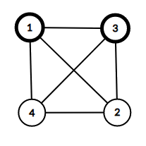
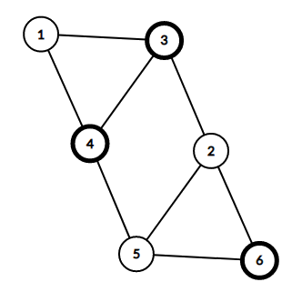

<h1 style='text-align: center;'> E. Cover it!</h1>

<h5 style='text-align: center;'>time limit per test: 2 seconds</h5>
<h5 style='text-align: center;'>memory limit per test: 256 megabytes</h5>

You are given an undirected unweighted connected graph consisting of $n$ vertices and $m$ edges. It is guaranteed that there are no self-loops or multiple edges in the given graph.

Your task is to choose at most $\lfloor\frac{n}{2}\rfloor$ vertices in this graph so each unchosen vertex is adjacent (in other words, connected by an edge) to at least one of chosen vertices.

It is guaranteed that the answer exists. If there are multiple answers, you can print any.

You will be given multiple independent queries to answer.

## Input

The first line contains a single integer $t$ ($1 \le t \le 2 \cdot 10^5$) — the number of queries.

Then $t$ queries follow.

The first line of each query contains two integers $n$ and $m$ ($2 \le n \le 2 \cdot 10^5$, $n - 1 \le m \le min(2 \cdot 10^5, \frac{n(n-1)}{2})$) — the number of vertices and the number of edges, respectively.

The following $m$ lines denote edges: edge $i$ is represented by a pair of integers $v_i$, $u_i$ ($1 \le v_i, u_i \le n$, $u_i \ne v_i$), which are the indices of vertices connected by the edge.

There are no self-loops or multiple edges in the given graph, i. e. for each pair ($v_i, u_i$) there are no other pairs ($v_i, u_i$) or ($u_i, v_i$) in the list of edges, and for each pair ($v_i, u_i$) the condition $v_i \ne u_i$ is satisfied. It is guaranteed that the given graph is connected.

It is guaranteed that $\sum m \le 2 \cdot 10^5$ over all queries.

## Output

For each query print two lines.

In the first line print $k$ ($1 \le \lfloor\frac{n}{2}\rfloor$) — the number of chosen vertices.

In the second line print $k$ distinct integers $c_1, c_2, \dots, c_k$ in any order, where $c_i$ is the index of the $i$-th chosen vertex.

It is guaranteed that the answer exists. If there are multiple answers, you can print any.

## Example

## Input


```

2
4 6
1 2
1 3
1 4
2 3
2 4
3 4
6 8
2 5
5 4
4 3
4 1
1 3
2 3
2 6
5 6

```
## Output


```

2
1 3
3
4 3 6

```
## Note

In the first query any vertex or any pair of vertices will suffice.

  ## Note

 that you don't have to minimize the number of chosen vertices. In the second query two vertices can be enough (vertices $2$ and $4$) but three is also ok.

  

#### tags 

#1700 #dfs_and_similar #dsu #graphs #shortest_paths #trees 