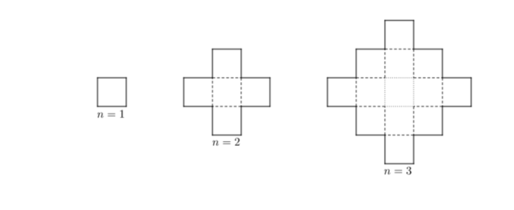

<h1 style='text-align: center;'> A. Alex and a Rhombus</h1>

<h5 style='text-align: center;'>time limit per test: 1 second</h5>
<h5 style='text-align: center;'>memory limit per test: 256 megabytes</h5>

While playing with geometric figures Alex has accidentally invented a concept of a $n$-th order rhombus in a cell grid.

A $1$-st order rhombus is just a square $1 \times 1$ (i.e just a cell).

A $n$-th order rhombus for all $n \geq 2$ one obtains from a $n-1$-th order rhombus adding all cells which have a common side with it to it (look at the picture to understand it better).

  Alex asks you to compute the number of cells in a $n$-th order rhombus.

## Input

The first and only input line contains integer $n$ ($1 \leq n \leq 100$) — order of a rhombus whose numbers of cells should be computed.

## Output

Print exactly one integer — the number of cells in a $n$-th order rhombus.

## Examples

## Input


```

1

```
## Output


```

1
```
## Input


```

2

```
## Output


```

5
```
## Input


```

3

```
## Output


```

13
```
## Note

Images of rhombus corresponding to the examples are given in the statement.


#### tags 

#800 #dp #implementation #math 