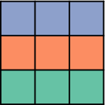
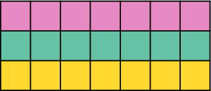
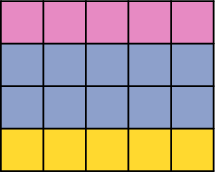
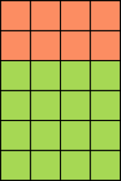
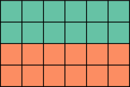
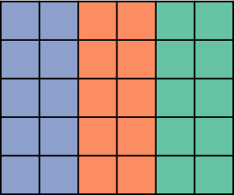
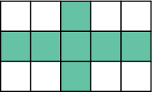
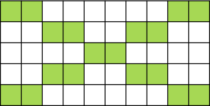
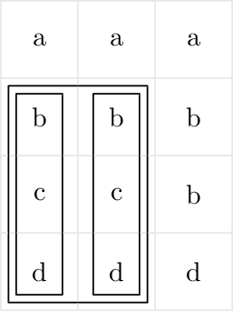
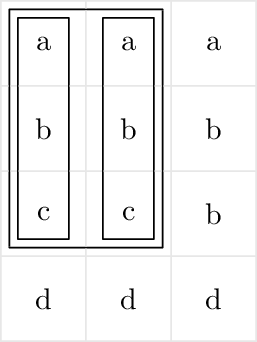

<h1 style='text-align: center;'> C. Flag</h1>

<h5 style='text-align: center;'>time limit per test: 2 seconds</h5>
<h5 style='text-align: center;'>memory limit per test: 512 megabytes</h5>

Innokenty works at a flea market and sells some random stuff rare items. Recently he found an old rectangular blanket. It turned out that the blanket is split in $n \cdot m$ colored pieces that form a rectangle with $n$ rows and $m$ columns. 

The colored pieces attracted Innokenty's attention so he immediately came up with the following business plan. If he cuts out a subrectangle consisting of three colored stripes, he can sell it as a flag of some country. Innokenty decided that a subrectangle is similar enough to a flag of some country if it consists of three stripes of equal heights placed one above another, where each stripe consists of cells of equal color. Of course, the color of the top stripe must be different from the color of the middle stripe; and the color of the middle stripe must be different from the color of the bottom stripe.

Innokenty has not yet decided what part he will cut out, but he is sure that the flag's boundaries should go along grid lines. Also, Innokenty won't rotate the blanket. Please help Innokenty and count the number of different subrectangles Innokenty can cut out and sell as a flag. Two subrectangles located in different places but forming the same flag are still considered different.

   These subrectangles are flags. 

      These subrectangles are not flags. 

## Input

The first line contains two integers $n$ and $m$ ($1 \le n, m \le 1\,000$) — the number of rows and the number of columns on the blanket.

Each of the next $n$ lines contains $m$ lowercase English letters from 'a' to 'z' and describes a row of the blanket. Equal letters correspond to equal colors, different letters correspond to different colors.

## Output

In the only line print the number of subrectangles which form valid flags.

## Examples

## Input


```

4 3
aaa
bbb
ccb
ddd

```
## Output


```

6

```
## Input


```

6 1
a
a
b
b
c
c

```
## Output


```

1

```
## Note

  The selected subrectangles are flags in the first example. 


#### tags 

#1900 #brute_force #combinatorics #dp #implementation 