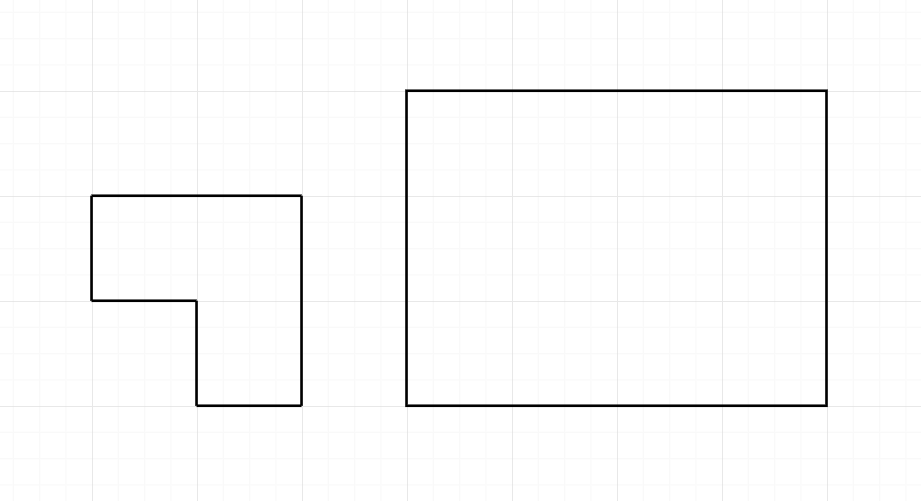

<h1 style='text-align: center;'> A. Filling Shapes</h1>

<h5 style='text-align: center;'>time limit per test: 1 second</h5>
<h5 style='text-align: center;'>memory limit per test: 256 megabytes</h5>

You have a given integer $n$. Find the number of ways to fill all $3 \times n$ tiles with the shape described in the picture below. Upon filling, no empty spaces are allowed. Shapes cannot overlap.

  This picture describes when $n = 4$. The left one is the shape and the right one is $3 \times n$ tiles. ## Input

The only line contains one integer $n$ ($1 \le n \le 60$) — the length.

## Output

Print the number of ways to fill.

## Examples

## Input


```

4

```
## Output


```

4
```
## Input


```

1

```
## Output


```

0
```
## Note

In the first example, there are $4$ possible cases of filling.

In the second example, you cannot fill the shapes in $3 \times 1$ tiles.


#### tags 

#1000 #dp #math 