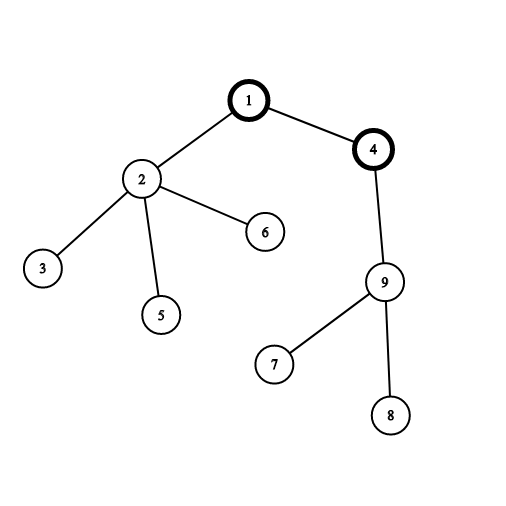

<h1 style='text-align: center;'> E. Tree Painting</h1>

<h5 style='text-align: center;'>time limit per test: 2 seconds</h5>
<h5 style='text-align: center;'>memory limit per test: 256 megabytes</h5>

You are given a tree (an undirected connected acyclic graph) consisting of $n$ vertices. You are playing a game on this tree.

Initially all vertices are white. On the first turn of the game you choose one vertex and paint it black. Then on each turn you choose a white vertex adjacent (connected by an edge) to any black vertex and paint it black.

Each time when you choose a vertex (even during the first turn), you gain the number of points equal to the size of the connected component consisting only of white vertices that contains the chosen vertex. The game ends when all vertices are painted black.

Let's see the following example:



Vertices $1$ and $4$ are painted black already. If you choose the vertex $2$, you will gain $4$ points for the connected component consisting of vertices $2, 3, 5$ and $6$. If you choose the vertex $9$, you will gain $3$ points for the connected component consisting of vertices $7, 8$ and $9$.

Your task is to maximize the number of points you gain.

## Input

The first line contains an integer $n$ — the number of vertices in the tree ($2 \le n \le 2 \cdot 10^5$).

Each of the next $n - 1$ lines describes an edge of the tree. Edge $i$ is denoted by two integers $u_i$ and $v_i$, the indices of vertices it connects ($1 \le u_i, v_i \le n$, $u_i \ne v_i$).

It is guaranteed that the given edges form a tree.

## Output

Print one integer — the maximum number of points you gain if you will play optimally.

## Examples

## Input


```

9
1 2
2 3
2 5
2 6
1 4
4 9
9 7
9 8

```
## Output


```

36

```
## Input


```

5
1 2
1 3
2 4
2 5

```
## Output


```

14

```
## Note

The first example tree is shown in the problem statement.


#### tags 

#2100 #dfs_and_similar #dp #trees 