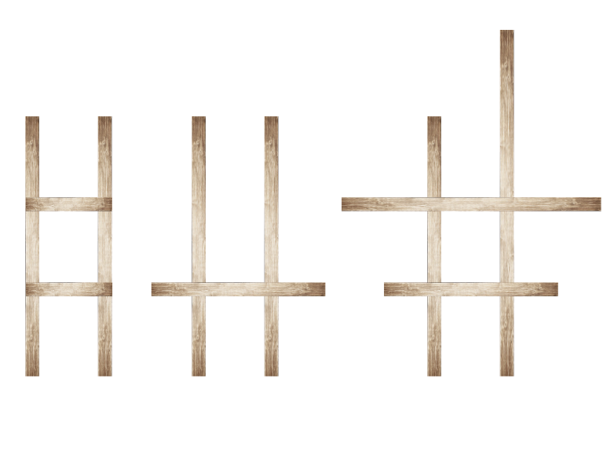

<h1 style='text-align: center;'> A. DIY Wooden Ladder</h1>

<h5 style='text-align: center;'>time limit per test: 2 seconds</h5>
<h5 style='text-align: center;'>memory limit per test: 256 megabytes</h5>

Let's denote a $k$-step ladder as the following structure: exactly $k + 2$ wooden planks, of which

* two planks of length at least $k+1$ — the base of the ladder;
* $k$ planks of length at least $1$ — the steps of the ladder;

## Note

 that neither the base planks, nor the steps planks are required to be equal.

For example, ladders $1$ and $3$ are correct $2$-step ladders and ladder $2$ is a correct $1$-step ladder. On the first picture the lengths of planks are $[3, 3]$ for the base and $[1]$ for the step. On the second picture lengths are $[3, 3]$ for the base and $[2]$ for the step. On the third picture lengths are $[3, 4]$ for the base and $[2, 3]$ for the steps. 

  You have $n$ planks. The length of the $i$-th planks is $a_i$. You don't have a saw, so you can't cut the planks you have. Though you have a hammer and nails, so you can assemble the improvised "ladder" from the planks.

The question is: what is the maximum number $k$ such that you can choose some subset of the given planks and assemble a $k$-step ladder using them?

## Input

The first line contains a single integer $T$ ($1 \le T \le 100$) — the number of queries. The queries are independent.

Each query consists of two lines. The first line contains a single integer $n$ ($2 \le n \le 10^5$) — the number of planks you have.

The second line contains $n$ integers $a_1, a_2, \dots, a_n$ ($1 \le a_i \le 10^5$) — the lengths of the corresponding planks.

It's guaranteed that the total number of planks from all queries doesn't exceed $10^5$.

## Output

Print $T$ integers — one per query. The $i$-th integer is the maximum number $k$, such that you can choose some subset of the planks given in the $i$-th query and assemble a $k$-step ladder using them.

Print $0$ if you can't make even $1$-step ladder from the given set of planks.

## Example

## Input


```

4
4
1 3 1 3
3
3 3 2
5
2 3 3 4 2
3
1 1 2

```
## Output


```

2
1
2
0

```
## Note

## Example

s for the queries $1-3$ are shown at the image in the legend section.

The Russian meme to express the quality of the ladders:

  

#### tags 

#900 #greedy #math #sortings 