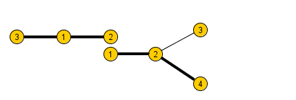

<h1 style='text-align: center;'> F. Spiders</h1>

<h5 style='text-align: center;'>time limit per test: 1 second</h5>
<h5 style='text-align: center;'>memory limit per test: 256 megabytes</h5>

One day mum asked Petya to sort his toys and get rid of some of them. Petya found a whole box of toy spiders. They were quite dear to him and the boy didn't want to throw them away. Petya conjured a cunning plan: he will glue all the spiders together and attach them to the ceiling. Besides, Petya knows that the lower the spiders will hang, the more mum is going to like it and then she won't throw his favourite toys away. Help Petya carry out the plan.

A spider consists of *k* beads tied together by *k* - 1 threads. Each thread connects two different beads, at that any pair of beads that make up a spider is either directly connected by a thread, or is connected via some chain of threads and beads.

Petya may glue spiders together directly gluing their beads. The length of each thread equals 1. The sizes of the beads can be neglected. That's why we can consider that gluing spiders happens by identifying some of the beads (see the picture). Besides, the construction resulting from the gluing process should also represent a spider, that is, it should have the given features. 

After Petya glues all spiders together, he measures the length of the resulting toy. The distance between a pair of beads is identified as the total length of the threads that connect these two beads. The length of the resulting construction is the largest distance between all pairs of beads. Petya wants to make the spider whose length is as much as possible.

    The picture two shows two spiders from the second sample. We can glue to the bead number 2 of the first spider the bead number 1 of the second spider. The threads in the spiders that form the sequence of threads of maximum lengths are highlighted on the picture.

## Input

The first input file line contains one integer *n* (1 ≤ *n* ≤ 100) — the number of spiders. Next *n* lines contain the descriptions of each spider: integer *n**i* (2 ≤ *n**i* ≤ 100) — the number of beads, then *n**i* - 1 pairs of numbers denoting the numbers of the beads connected by threads. The beads that make up each spider are numbered from 1 to *n**i*.

## Output

Print a single number — the length of the required construction.

## Examples

## Input


```
1  
3 1 2 2 3  

```
## Output


```
2  

```
## Input


```
2  
3 1 2 1 3  
4 1 2 2 3 2 4  

```
## Output


```
4  

```
## Input


```
2  
5 1 2 2 3 3 4 3 5  
7 3 4 1 2 2 4 4 6 2 7 6 5  

```
## Output


```
7  

```


#### tags 

#1400 #dp #greedy #trees 