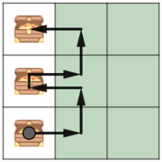
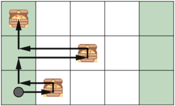
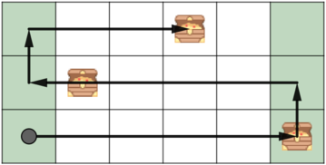

<h1 style='text-align: center;'> D. Treasure Hunting</h1>

<h5 style='text-align: center;'>time limit per test: 3 seconds</h5>
<h5 style='text-align: center;'>memory limit per test: 256 megabytes</h5>

You are on the island which can be represented as a $n \times m$ table. The rows are numbered from $1$ to $n$ and the columns are numbered from $1$ to $m$. There are $k$ treasures on the island, the $i$-th of them is located at the position $(r_i, c_i)$.

Initially you stand at the lower left corner of the island, at the position $(1, 1)$. If at any moment you are at the cell with a treasure, you can pick it up without any extra time. In one move you can move up (from $(r, c)$ to $(r+1, c)$), left (from $(r, c)$ to $(r, c-1)$), or right (from position $(r, c)$ to $(r, c+1)$). Because of the traps, you can't move down.

However, moving up is also risky. You can move up only if you are in a safe column. There are $q$ safe columns: $b_1, b_2, \ldots, b_q$. You want to collect all the treasures as fast as possible. Count the minimum number of moves required to collect all the treasures.

## Input

The first line contains integers $n$, $m$, $k$ and $q$ ($2 \le n, \, m, \, k, \, q \le 2 \cdot 10^5$, $q \le m$) — the number of rows, the number of columns, the number of treasures in the island and the number of safe columns.

Each of the next $k$ lines contains two integers $r_i, c_i$, ($1 \le r_i \le n$, $1 \le c_i \le m$) — the coordinates of the cell with a treasure. All treasures are located in distinct cells.

The last line contains $q$ distinct integers $b_1, b_2, \ldots, b_q$ ($1 \le b_i \le m$) — the indices of safe columns.

## Output

Print the minimum number of moves required to collect all the treasures.

## Examples

## Input


```

3 3 3 2
1 1
2 1
3 1
2 3

```
## Output


```

6
```
## Input


```

3 5 3 2
1 2
2 3
3 1
1 5

```
## Output


```

8
```
## Input


```

3 6 3 2
1 6
2 2
3 4
1 6

```
## Output


```

15
```
## Note

In the first example you should use the second column to go up, collecting in each row treasures from the first column.

  In the second example, it is optimal to use the first column to go up.

  In the third example, it is optimal to collect the treasure at cell $(1;6)$, go up to row $2$ at column $6$, then collect the treasure at cell $(2;2)$, go up to the top row at column $1$ and collect the last treasure at cell $(3;4)$. That's a total of $15$ moves.

  

#### tags 

#2100 #binary_search #dp #greedy #implementation 