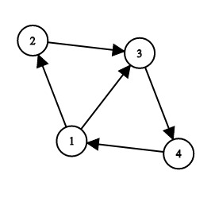

<h1 style='text-align: center;'> C. Anna, Svyatoslav and Maps</h1>

<h5 style='text-align: center;'>time limit per test: 2 seconds</h5>
<h5 style='text-align: center;'>memory limit per test: 256 megabytes</h5>

The main characters have been omitted to be short.

You are given a directed unweighted graph without loops with $n$ vertexes and a path in it (that path is not necessary simple) given by a sequence $p_1, p_2, \ldots, p_m$ of $m$ vertexes; for each $1 \leq i < m$ there is an arc from $p_i$ to $p_{i+1}$.

Define the sequence $v_1, v_2, \ldots, v_k$ of $k$ vertexes as good, if $v$ is a subsequence of $p$, $v_1 = p_1$, $v_k = p_m$, and $p$ is one of the shortest paths passing through the vertexes $v_1$, $\ldots$, $v_k$ in that order.

A sequence $a$ is a subsequence of a sequence $b$ if $a$ can be obtained from $b$ by deletion of several (possibly, zero or all) elements. It is obvious that the sequence $p$ is good but your task is to find the shortest good subsequence.

If there are multiple shortest good subsequences, output any of them.

 

## Input

The first line contains a single integer $n$ ($2 \le n \le 100$) — the number of vertexes in a graph. 

The next $n$ lines define the graph by an adjacency matrix: the $j$-th character in the $i$-st line is equal to $1$ if there is an arc from vertex $i$ to the vertex $j$ else it is equal to $0$. It is guaranteed that the graph doesn't contain loops.

The next line contains a single integer $m$ ($2 \le m \le 10^6$) — the number of vertexes in the path. 

The next line contains $m$ integers $p_1, p_2, \ldots, p_m$ ($1 \le p_i \le n$) — the sequence of vertexes in the path. It is guaranteed that for any $1 \leq i < m$ there is an arc from $p_i$ to $p_{i+1}$.

## Output

In the first line output a single integer $k$ ($2 \leq k \leq m$) — the length of the shortest good subsequence. In the second line output $k$ integers $v_1$, $\ldots$, $v_k$ ($1 \leq v_i \leq n$) — the vertexes in the subsequence. If there are multiple shortest subsequences, print any. Any two consecutive numbers should be distinct.

## Examples

## Input


```

4
0110
0010
0001
1000
4
1 2 3 4

```
## Output


```

3
1 2 4 
```
## Input


```

4
0110
0010
1001
1000
20
1 2 3 4 1 2 3 4 1 2 3 4 1 2 3 4 1 2 3 4

```
## Output


```

11
1 2 4 2 4 2 4 2 4 2 4 
```
## Input


```

3
011
101
110
7
1 2 3 1 3 2 1

```
## Output


```

7
1 2 3 1 3 2 1 
```
## Input


```

4
0110
0001
0001
1000
3
1 2 4

```
## Output


```

2
1 4 
```
## Note

Below you can see the graph from the first example:



The given path is passing through vertexes $1$, $2$, $3$, $4$. The sequence $1-2-4$ is good because it is the subsequence of the given path, its first and the last elements are equal to the first and the last elements of the given path respectively, and the shortest path passing through vertexes $1$, $2$ and $4$ in that order is $1-2-3-4$. ## Note

 that subsequences $1-4$ and $1-3-4$ aren't good because in both cases the shortest path passing through the vertexes of these sequences is $1-3-4$.

In the third example, the graph is full so any sequence of vertexes in which any two consecutive elements are distinct defines a path consisting of the same number of vertexes.

In the fourth example, the paths $1-2-4$ and $1-3-4$ are the shortest paths passing through the vertexes $1$ and $4$.


#### tags 

#1700 #dp #graphs #greedy #shortest_paths 