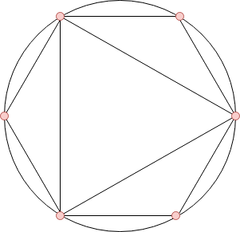

<h1 style='text-align: center;'> G. Polygons</h1>

<h5 style='text-align: center;'>time limit per test: 1 second</h5>
<h5 style='text-align: center;'>memory limit per test: 256 megabytes</h5>

You are given two integers $n$ and $k$.

You need to construct $k$ regular polygons having same [circumcircle](https://en.wikipedia.org/wiki/Circumscribed_circle), with distinct number of sides $l$ between $3$ and $n$. 

  Illustration for the first example. You can rotate them to minimize the total number of distinct points on the circle. Find the minimum number of such points.

## Input

The only line of input contains two integers $n$ and $k$ ($3 \le n \le 10^{6}$, $1 \le k \le n-2$), the maximum number of sides of a polygon and the number of polygons to construct, respectively.

## Output

Print a single integer — the minimum number of points required for $k$ polygons.

## Examples

## Input


```

6 2

```
## Output


```

6

```
## Input


```

200 50

```
## Output


```

708

```
## Note

In the first example, we have $n = 6$ and $k = 2$. So, we have $4$ polygons with number of sides $3$, $4$, $5$ and $6$ to choose from and if we choose the triangle and the hexagon, then we can arrange them as shown in the picture in the statement.

Hence, the minimum number of points required on the circle is $6$, which is also the minimum overall possible sets.


#### tags 

#2800 #greedy #math #number_theory 