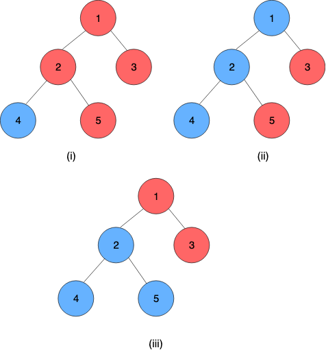

<h1 style='text-align: center;'> H. Red Blue Tree</h1>

<h5 style='text-align: center;'>time limit per test: 5 seconds</h5>
<h5 style='text-align: center;'>memory limit per test: 256 megabytes</h5>

You are given a tree of $n$ nodes. The tree is rooted at node $1$, which is not considered as a leaf regardless of its degree.

Each leaf of the tree has one of the two colors: red or blue. Leaf node $v$ initially has color $s_{v}$.

The color of each of the internal nodes (including the root) is determined as follows. 

* Let $b$ be the number of blue immediate children, and $r$ be the number of red immediate children of a given vertex.
* Then the color of this vertex is blue if and only if $b - r \ge k$, otherwise red.

Integer $k$ is a parameter that is same for all the nodes.

You need to handle the following types of queries: 

* 1 v: print the color of node $v$;
* 2 v c: change the color of leaf $v$ to $c$ ($c = 0$ means red, $c = 1$ means blue);
* 3 h: update the current value of $k$ to $h$.
## Input

The first line of the input consists of two integers $n$ and $k$ ($2 \le n \le 10^{5}$, $-n \le k \le n$) — the number of nodes and the initial parameter $k$.

Each of the next $n - 1$ lines contains two integers $u$ and $v$ ($1 \le u,v \le n$), denoting that there is an edge between vertices $u$ and $v$.

The next line consists of $n$ space separated integers — the initial array $s$ ($-1 \le s_i \le 1$). $s_{i} = 0$ means that the color of node $i$ is red. $s_{i} = 1$ means that the color of node $i$ is blue. $s_{i} = -1$ means that the node $i$ is not a leaf.

The next line contains an integer $q$ ($1 \le q \le 10^5$), the number of queries.

$q$ lines follow, each containing a query in one of the following queries: 

* 1 v ($1 \le v \le n$): print the color of node $v$;
* 2 v c ($1 \le v \le n$, $c = 0$ or $c = 1$): change the color of leaf $v$ to $c$ ($c = 0$ means red, $c = 1$ means blue). It is guaranteed that $v$ is a leaf;
* 3 h ($-n \le h \le n$): update the current value of $k$ to $h$.
## Output

For each query of the first type, print $0$ if the color of vertex $v$ is red, and $1$ otherwise.

## Example

## Input


```

5 2
1 2
1 3
2 4
2 5
-1 -1 0 1 0
9
1 1
1 2
3 -2
1 1
1 2
3 1
2 5 1
1 1
1 2

```
## Output


```

0
0
1
1
0
1

```
## Note

 Figures:(i) The initial tree 

(ii) The tree after the 3rd query 

(iii) The tree after the 7th query 

 

  

#### tags 

#3500 #data_structures #implementation #trees 