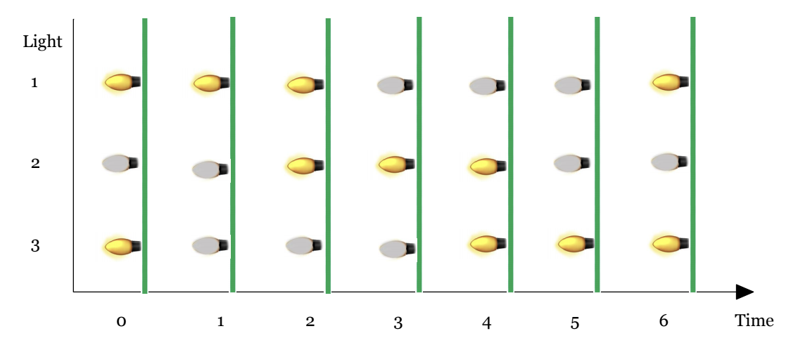

<h1 style='text-align: center;'> B. Koala and Lights</h1>

<h5 style='text-align: center;'>time limit per test: 1 second</h5>
<h5 style='text-align: center;'>memory limit per test: 256 megabytes</h5>

It is a holiday season, and Koala is decorating his house with cool lights! He owns $n$ lights, all of which flash periodically.

After taking a quick glance at them, Koala realizes that each of his lights can be described with two parameters $a_i$ and $b_i$. Light with parameters $a_i$ and $b_i$ will toggle (on to off, or off to on) every $a_i$ seconds starting from the $b_i$-th second. In other words, it will toggle at the moments $b_i$, $b_i + a_i$, $b_i + 2 \cdot a_i$ and so on.

You know for each light whether it's initially on or off and its corresponding parameters $a_i$ and $b_i$. Koala is wondering what is the maximum number of lights that will ever be on at the same time. So you need to find that out.

  Here is a graphic for the first example. ## Input

The first line contains a single integer $n$ ($1 \le n \le 100$), the number of lights.

The next line contains a string $s$ of $n$ characters. The $i$-th character is "1", if the $i$-th lamp is initially on. Otherwise, $i$-th character is "0".

The $i$-th of the following $n$ lines contains two integers $a_i$ and $b_i$ ($1 \le a_i, b_i \le 5$)  — the parameters of the $i$-th light.

## Output

Print a single integer — the maximum number of lights that will ever be on at the same time.

## Examples

## Input


```

3
101
3 3
3 2
3 1

```
## Output


```

2

```
## Input


```

4
1111
3 4
5 2
3 1
3 2

```
## Output


```

4

```
## Input


```

6
011100
5 3
5 5
2 4
3 5
4 2
1 5

```
## Output


```

6

```
## Note

For first example, the lamps' states are shown in the picture above. The largest number of simultaneously on lamps is $2$ (e.g. at the moment $2$).

In the second example, all lights are initially on. So the answer is $4$.


#### tags 

#1300 #implementation #math #number_theory 