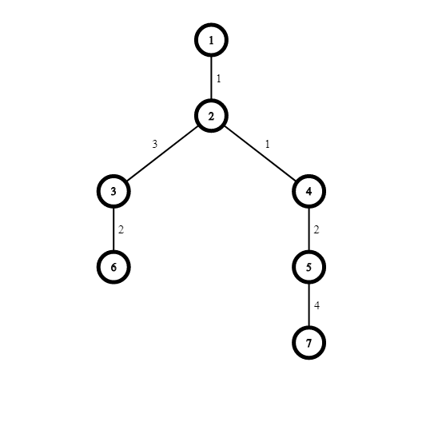

<h1 style='text-align: center;'> G. Path Queries</h1>

<h5 style='text-align: center;'>time limit per test: 3 seconds</h5>
<h5 style='text-align: center;'>memory limit per test: 256 megabytes</h5>

You are given a weighted tree consisting of $n$ vertices. Recall that a tree is a connected graph without cycles. Vertices $u_i$ and $v_i$ are connected by an edge with weight $w_i$.

You are given $m$ queries. The $i$-th query is given as an integer $q_i$. In this query you need to calculate the number of pairs of vertices $(u, v)$ ($u < v$) such that the maximum weight of an edge on a simple path between $u$ and $v$ doesn't exceed $q_i$.

## Input

The first line of the input contains two integers $n$ and $m$ ($1 \le n, m \le 2 \cdot 10^5$) — the number of vertices in the tree and the number of queries.

Each of the next $n - 1$ lines describes an edge of the tree. Edge $i$ is denoted by three integers $u_i$, $v_i$ and $w_i$ — the labels of vertices it connects ($1 \le u_i, v_i \le n$, $u_i \ne v_i$) and the weight of the edge ($1 \le w_i \le 2 \cdot 10^5$). It is guaranteed that the given edges form a tree.

The last line of the input contains $m$ integers $q_1, q_2, \dots, q_m$ ($1 \le q_i \le 2 \cdot 10^5$), where $q_i$ is the maximum weight of an edge in the $i$-th query.

## Output

Print $m$ integers — the answers to the queries. The $i$-th value should be equal to the number of pairs of vertices $(u, v)$ ($u < v$) such that the maximum weight of an edge on a simple path between $u$ and $v$ doesn't exceed $q_i$.

Queries are numbered from $1$ to $m$ in the order of the input.

## Examples

## Input


```

7 5
1 2 1
3 2 3
2 4 1
4 5 2
5 7 4
3 6 2
5 2 3 4 1

```
## Output


```

21 7 15 21 3 

```
## Input


```

1 2
1 2

```
## Output


```

0 0 

```
## Input


```

3 3
1 2 1
2 3 2
1 3 2

```
## Output


```

1 3 3 

```
## Note

The picture shows the tree from the first example: 


#### tags 

#1800 #divide_and_conquer #dsu #graphs #sortings #trees 