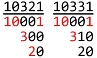

<h1 style='text-align: center;'> E. Sum Queries?</h1>

<h5 style='text-align: center;'>time limit per test: 2 seconds</h5>
<h5 style='text-align: center;'>memory limit per test: 256 megabytes</h5>

Let's define a balanced multiset the following way. Write down the sum of all elements of the multiset in its decimal representation. For each position of that number check if the multiset includes at least one element such that the digit of the element and the digit of the sum at that position are the same. If that holds for every position, then the multiset is balanced. Otherwise it's unbalanced.

For example, multiset $\{20, 300, 10001\}$ is balanced and multiset $\{20, 310, 10001\}$ is unbalanced: 

  The red digits mark the elements and the positions for which these elements have the same digit as the sum. The sum of the first multiset is $10321$, every position has the digit required. The sum of the second multiset is $10331$ and the second-to-last digit doesn't appear in any number, thus making the multiset unbalanced.

You are given an array $a_1, a_2, \dots, a_n$, consisting of $n$ integers.

You are asked to perform some queries on it. The queries can be of two types:

* $1~i~x$ — replace $a_i$ with the value $x$;
* $2~l~r$ — find the unbalanced subset of the multiset of the numbers $a_l, a_{l + 1}, \dots, a_r$ with the minimum sum, or report that no unbalanced subset exists.

## Note

 that the empty multiset is balanced.

For each query of the second type print the lowest sum of the unbalanced subset. Print -1 if no unbalanced subset exists.

## Input

The first line contains two integers $n$ and $m$ ($1 \le n, m \le 2 \cdot 10^5$) — the number of elements in the array and the number of queries, respectively.

The second line contains $n$ integers $a_1, a_2, \dots, a_n$ ($1 \le a_i < 10^9$).

Each of the following $m$ lines contains a query of one of two types:

* $1~i~x$ ($1 \le i \le n$, $1 \le x < 10^9$) — replace $a_i$ with the value $x$;
* $2~l~r$ ($1 \le l \le r \le n$) — find the unbalanced subset of the multiset of the numbers $a_l, a_{l + 1}, \dots, a_r$ with the lowest sum, or report that no unbalanced subset exists.

It is guaranteed that there is at least one query of the second type.

## Output

For each query of the second type print the lowest sum of the unbalanced subset. Print -1 if no unbalanced subset exists.

## Example

## Input


```

4 5
300 10001 20 20
2 1 3
1 1 310
2 1 3
2 3 3
2 3 4

```
## Output


```

-1
330
-1
40

```
## Note

All the subsets of multiset $\{20, 300, 10001\}$ are balanced, thus the answer is -1.

The possible unbalanced subsets in the third query are $\{20, 310\}$ and $\{20, 310, 10001\}$. The lowest sum one is $\{20, 310\}$. ## Note

 that you are asked to choose a subset, not a subsegment, thus the chosen elements might not be adjancent in the array.

The fourth query includes only the empty subset and subset $\{20\}$. Both of them are balanced.

The last query includes the empty subset and the subsets $\{20\}$, $\{20\}$ and $\{20, 20\}$. Only $\{20, 20\}$ is unbalanced, its sum is $40$. ## Note

 that you are asked to choose a multiset, thus it might include equal elements.


#### tags 

#2300 #data_structures #greedy #implementation #math 