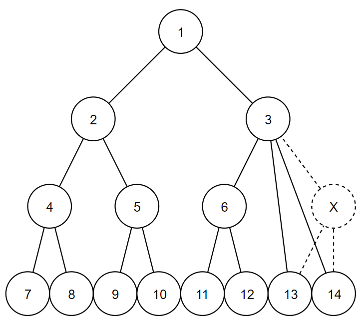
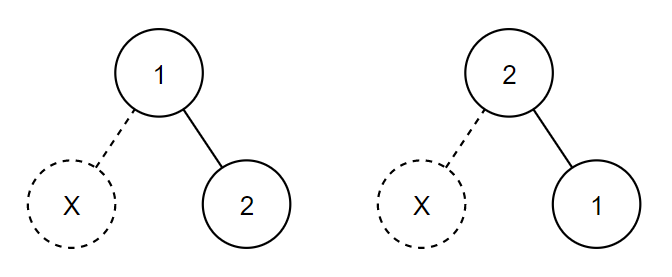

<h1 style='text-align: center;'> F. One Node is Gone</h1>

<h5 style='text-align: center;'>time limit per test: 1 second</h5>
<h5 style='text-align: center;'>memory limit per test: 256 megabytes</h5>

You have an integer $n$. Let's define following tree generation as McDic's generation:

1. Make a complete and full binary tree of $2^{n} - 1$ vertices. Complete and full binary tree means a tree that exactly one vertex is a root, all leaves have the same depth (distance from the root), and all non-leaf nodes have exactly two child nodes.
2. Select a non-root vertex $v$ from that binary tree.
3. Remove $v$ from tree and make new edges between $v$'s parent and $v$'s direct children. If $v$ has no children, then no new edges will be made.

You have a tree. Determine if this tree can be made by McDic's generation. If yes, then find the parent vertex of removed vertex in tree.

## Input

The first line contains integer $n$ ($2 \le n \le 17$).

The $i$-th of the next $2^{n} - 3$ lines contains two integers $a_{i}$ and $b_{i}$ ($1 \le a_{i} \lt b_{i} \le 2^{n} - 2$) — meaning there is an edge between $a_{i}$ and $b_{i}$. It is guaranteed that the given edges form a tree.

## Output

Print two lines.

In the first line, print a single integer — the number of answers. If given tree cannot be made by McDic's generation, then print $0$.

In the second line, print all possible answers in ascending order, separated by spaces. If the given tree cannot be made by McDic's generation, then don't print anything.

## Examples

## Input


```

4
1 2
1 3
2 4
2 5
3 6
3 13
3 14
4 7
4 8
5 9
5 10
6 11
6 12

```
## Output


```

1
3

```
## Input


```

2
1 2

```
## Output


```

2
1 2

```
## Input


```

3
1 2
2 3
3 4
4 5
5 6

```
## Output


```

0

```
## Note

In the first example, $3$ is the only possible answer.

  In the second example, there are $2$ possible answers.

  In the third example, the tree can't be generated by McDic's generation.


#### tags 

#2500 #constructive_algorithms #implementation #trees 