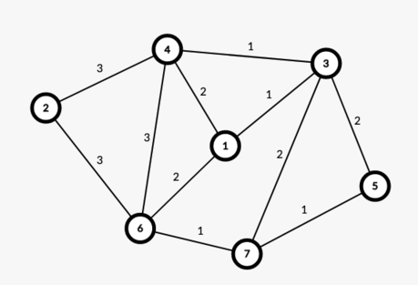

<h1 style='text-align: center;'> F. Football</h1>

<h5 style='text-align: center;'>time limit per test: 1 second</h5>
<h5 style='text-align: center;'>memory limit per test: 256 megabytes</h5>

There are $n$ football teams in the world. 

The Main Football Organization (MFO) wants to host at most $m$ games. MFO wants the $i$-th game to be played between the teams $a_i$ and $b_i$ in one of the $k$ stadiums. 

Let $s_{ij}$ be the numbers of games the $i$-th team played in the $j$-th stadium. MFO does not want a team to have much more games in one stadium than in the others. Therefore, for each team $i$, the absolute difference between the maximum and minimum among $s_{i1}, s_{i2}, \ldots, s_{ik}$ should not exceed $2$.

Each team has $w_i$ — the amount of money MFO will earn for each game of the $i$-th team. If the $i$-th team plays $l$ games, MFO will earn $w_i \cdot l$.

MFO needs to find what games in what stadiums they need to host in order to earn as much money as possible, not violating the rule they set.

However, this problem is too complicated for MFO. Therefore, they are asking you to help them.

## Input

The first line contains three integers $n$, $m$, $k$ ($3 \leq n \leq 100$, $0 \leq m \leq 1\,000$, $1 \leq k \leq 1\,000$) — the number of teams, the number of games, and the number of stadiums.

The second line contains $n$ integers $w_1, w_2, \ldots, w_n$ ($1 \leq w_i \leq 1\,000$) — the amount of money MFO will earn for each game of the $i$-th game.

Each of the following $m$ lines contains two integers $a_i$ and $b_i$ ($1 \leq a_i, b_i \leq n$, $a_i \neq b_i$) — the teams that can play the $i$-th game. It is guaranteed that each pair of teams can play at most one game.

## Output

For each game in the same order, print $t_i$ ($1 \leq t_i \leq k$) — the number of the stadium, in which $a_i$ and $b_i$ will play the game. If the $i$-th game should not be played, $t_i$ should be equal to $0$.

If there are multiple answers, print any.

## Example

## Input


```

7 11 3
4 7 8 10 10 9 3
6 2
6 1
7 6
4 3
4 6
3 1
5 3
7 5
7 3
4 2
1 4

```
## Output


```

3
2
1
1
3
1
2
1
2
3
2

```
## Note

One of possible solutions to the example is shown below:

  

#### tags 

#3100 #graphs 