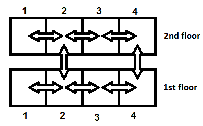

<h1 style='text-align: center;'> B. Rooms and Staircases</h1>

<h5 style='text-align: center;'>time limit per test: 1 second</h5>
<h5 style='text-align: center;'>memory limit per test: 256 megabytes</h5>

Nikolay lives in a two-storied house. There are $n$ rooms on each floor, arranged in a row and numbered from one from left to right. So each room can be represented by the number of the floor and the number of the room on this floor (room number is an integer between $1$ and $n$). 

If Nikolay is currently in some room, he can move to any of the neighbouring rooms (if they exist). Rooms with numbers $i$ and $i+1$ on each floor are neighbouring, for all $1 \leq i \leq n - 1$. There may also be staircases that connect two rooms from different floors having the same numbers. If there is a staircase connecting the room $x$ on the first floor and the room $x$ on the second floor, then Nikolay can use it to move from one room to another.

   The picture illustrates a house with $n = 4$. There is a staircase between the room $2$ on the first floor and the room $2$ on the second floor, and another staircase between the room $4$ on the first floor and the room $4$ on the second floor. The arrows denote possible directions in which Nikolay can move. The picture corresponds to the string "0101" in the input.  Nikolay wants to move through some rooms in his house. To do this, he firstly chooses any room where he starts. Then Nikolay moves between rooms according to the aforementioned rules. Nikolay never visits the same room twice (he won't enter a room where he has already been). 

Calculate the maximum number of rooms Nikolay can visit during his tour, if:

* he can start in any room on any floor of his choice,
* and he won't visit the same room twice.
## Input

The first line of the input contains one integer $t$ ($1 \le t \le 100$) — the number of test cases in the input. Then test cases follow. Each test case consists of two lines.

The first line contains one integer $n$ $(1 \le n \le 1\,000)$ — the number of rooms on each floor.

The second line contains one string consisting of $n$ characters, each character is either a '0' or a '1'. If the $i$-th character is a '1', then there is a staircase between the room $i$ on the first floor and the room $i$ on the second floor. If the $i$-th character is a '0', then there is no staircase between the room $i$ on the first floor and the room $i$ on the second floor.

In hacks it is allowed to use only one test case in the input, so $t = 1$ should be satisfied.

## Output

For each test case print one integer — the maximum number of rooms Nikolay can visit during his tour, if he can start in any room on any floor, and he won't visit the same room twice.

## Example

## Input


```

4
5
00100
8
00000000
5
11111
3
110

```
## Output


```

6
8
10
6

```
## Note

In the first test case Nikolay may start in the first room of the first floor. Then he moves to the second room on the first floor, and then — to the third room on the first floor. Then he uses a staircase to get to the third room on the second floor. Then he goes to the fourth room on the second floor, and then — to the fifth room on the second floor. So, Nikolay visits $6$ rooms.

There are no staircases in the second test case, so Nikolay can only visit all rooms on the same floor (if he starts in the leftmost or in the rightmost room).

In the third test case it is possible to visit all rooms: first floor, first room $\rightarrow$ second floor, first room $\rightarrow$ second floor, second room $\rightarrow$ first floor, second room $\rightarrow$ first floor, third room $\rightarrow$ second floor, third room $\rightarrow$ second floor, fourth room $\rightarrow$ first floor, fourth room $\rightarrow$ first floor, fifth room $\rightarrow$ second floor, fifth room.

In the fourth test case it is also possible to visit all rooms: second floor, third room $\rightarrow$ second floor, second room $\rightarrow$ second floor, first room $\rightarrow$ first floor, first room $\rightarrow$ first floor, second room $\rightarrow$ first floor, third room.


#### tags 

#1000 #brute_force #implementation 