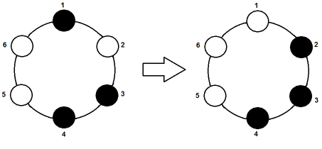

<h1 style='text-align: center;'> F. Chips</h1>

<h5 style='text-align: center;'>time limit per test: 1 second</h5>
<h5 style='text-align: center;'>memory limit per test: 256 megabytes</h5>

There are $n$ chips arranged in a circle, numbered from $1$ to $n$. 

Initially each chip has black or white color. Then $k$ iterations occur. During each iteration the chips change their colors according to the following rules. For each chip $i$, three chips are considered: chip $i$ itself and two its neighbours. If the number of white chips among these three is greater than the number of black chips among these three chips, then the chip $i$ becomes white. Otherwise, the chip $i$ becomes black. 

## Note

 that for each $i$ from $2$ to $(n - 1)$ two neighbouring chips have numbers $(i - 1)$ and $(i + 1)$. The neighbours for the chip $i = 1$ are $n$ and $2$. The neighbours of $i = n$ are $(n - 1)$ and $1$.

The following picture describes one iteration with $n = 6$. The chips $1$, $3$ and $4$ are initially black, and the chips $2$, $5$ and $6$ are white. After the iteration $2$, $3$ and $4$ become black, and $1$, $5$ and $6$ become white.

  Your task is to determine the color of each chip after $k$ iterations.

## Input

The first line contains two integers $n$ and $k$ $(3 \le n \le 200\,000, 1 \le k \le 10^{9})$ — the number of chips and the number of iterations, respectively.

The second line contains a string consisting of $n$ characters "W" and "B". If the $i$-th character is "W", then the $i$-th chip is white initially. If the $i$-th character is "B", then the $i$-th chip is black initially.

## Output

Print a string consisting of $n$ characters "W" and "B". If after $k$ iterations the $i$-th chip is white, then the $i$-th character should be "W". Otherwise the $i$-th character should be "B".

## Examples

## Input


```

6 1
BWBBWW

```
## Output


```

WBBBWW

```
## Input


```

7 3
WBWBWBW

```
## Output


```

WWWWWWW

```
## Input


```

6 4
BWBWBW

```
## Output


```

BWBWBW

```
## Note

The first example is described in the statement.

The second example: "WBWBWBW" $\rightarrow$ "WWBWBWW" $\rightarrow$ "WWWBWWW" $\rightarrow$ "WWWWWWW". So all chips become white.

The third example: "BWBWBW" $\rightarrow$ "WBWBWB" $\rightarrow$ "BWBWBW" $\rightarrow$ "WBWBWB" $\rightarrow$ "BWBWBW".


#### tags 

#2300 #constructive_algorithms #implementation 