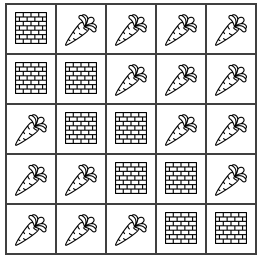

<h1 style='text-align: center;'> M. SmartGarden</h1>

<h5 style='text-align: center;'>time limit per test: 2 seconds</h5>
<h5 style='text-align: center;'>memory limit per test: 512 megabytes</h5>

Berland Gardeners United Inc. hired you for the project called "SmartGarden". The main feature of this project is automatic garden watering.

Formally the garden can be represented as a square of $n \times n$ cells with rows numbered $1$ to $n$ from top to bottom and columns numbered $1$ to $n$ from left to right. Each cell of the garden contains either a plant or a slab. 

It's known that slabs are located on the main diagonal of the matrix representing the garden, and in the cells that are below the main diagonal and share a side with at least one cell of the main diagonal. All the remaining cells of the garden are filled with plants.

  Example of the garden for $n=5$. During implementation of the project you created a smart robot that takes a list of commands as an input, which are processed one by one. Each command contains: 

* a list of horizontal lines (rows in the matrix representing the garden);
* a list of vertical lines (columns in the matrix representing the garden).

While executing each command robot waters only cells in the intersection of specified rows and specified columns. So, if you specify $r$ rows and $c$ columns, then exactly $r \cdot c$ cells will be watered.

In the demo for the customer you have tuned robot in such a way that it waters all the garden. To do that you prepared a single command containing all $n$ rows and all $n$ columns.

Unfortunately, 5 hours before the demo for your customer it turned out that the CEO of Berland Gardeners United Inc. was going to take part in it. Moreover, most probably he will be standing on a garden slab during the demo!

Now you need to create a list of commands for the robot so that it waters all the plants and doesn't water any cell containing a slab. Since it's only a beta version of "SmartGarden", the total number of commands shouldn't exceed $50$.

Create a program that, for a given size of the garden, will find a list of no more than $50$ commands that allow the robot to water all the plants in the garden without watering the slabs. It is allowed to water a plant several times.

## Input

The first and the only line of the input contains a single integer $n$ ($2 \le n \le 5000$), where $n$ is the size of the garden.

## Output

In the first line print the total number of commands for the robot $k$ ($1 \le k \le 50$). In the next $2 \cdot k$ lines print all the commands. Each command should be specified by $2$ lines. The first line of each command should describe rows in the command and the second line should describe columns in the command. Each of these $2$ lines should have the following format:

* the first number of the line should specify the total number of items $x$ in the appropriate list;
* then $x$ distinct numbers follow, where each number is in the range $1 \dots n$ and describes a chosen row for the first line and a chosen column for the second line.

If there are multiple ways to water the garden, print any of them.

## Examples

## Input


```

2
```
## Output


```

2
1 1
1 2
1 1
1 2

```
## Input


```

4
```
## Output


```

4
2 1 4
1 2
2 1 2
2 3 4
1 3
2 1 4
1 4
1 1

```


#### tags 

#2500 #constructive_algorithms #divide_and_conquer 