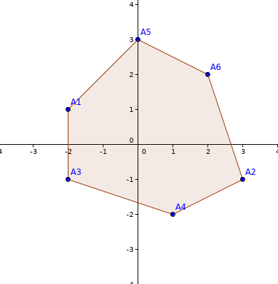

<h1 style='text-align: center;'> C. Point Ordering</h1>

<h5 style='text-align: center;'>time limit per test: 1 second</h5>
<h5 style='text-align: center;'>memory limit per test: 256 megabytes</h5>

This is an interactive problem.

Khanh has $n$ points on the Cartesian plane, denoted by $a_1, a_2, \ldots, a_n$. All points' coordinates are integers between $-10^9$ and $10^9$, inclusive. No three points are collinear. He says that these points are vertices of a convex polygon; in other words, there exists a permutation $p_1, p_2, \ldots, p_n$ of integers from $1$ to $n$ such that the polygon $a_{p_1} a_{p_2} \ldots a_{p_n}$ is convex and vertices are listed in counter-clockwise order.

Khanh gives you the number $n$, but hides the coordinates of his points. Your task is to guess the above permutation by asking multiple queries. In each query, you give Khanh $4$ integers $t$, $i$, $j$, $k$; where either $t = 1$ or $t = 2$; and $i$, $j$, $k$ are three distinct indices from $1$ to $n$, inclusive. In response, Khanh tells you:

* if $t = 1$, the area of the triangle $a_ia_ja_k$ multiplied by $2$.
* if $t = 2$, the sign of the cross product of two vectors $\overrightarrow{a_ia_j}$ and $\overrightarrow{a_ia_k}$.

Recall that the cross product of vector $\overrightarrow{a} = (x_a, y_a)$ and vector $\overrightarrow{b} = (x_b, y_b)$ is the integer $x_a \cdot y_b - x_b \cdot y_a$. The sign of a number is $1$ it it is positive, and $-1$ otherwise. It can be proven that the cross product obtained in the above queries can not be $0$.

You can ask at most $3 \cdot n$ queries.

Please note that Khanh fixes the coordinates of his points and does not change it while answering your queries. You do not need to guess the coordinates. In your permutation $a_{p_1}a_{p_2}\ldots a_{p_n}$, $p_1$ should be equal to $1$ and the indices of vertices should be listed in counter-clockwise order.

## Interaction

You start the interaction by reading $n$ ($3 \leq n \leq 1\,000$) — the number of vertices.

To ask a query, write $4$ integers $t$, $i$, $j$, $k$ ($1 \leq t \leq 2$, $1 \leq i, j, k \leq n$) in a separate line. $i$, $j$ and $k$ should be distinct.

Then read a single integer to get the answer to this query, as explained above. It can be proven that the answer of a query is always an integer.

When you find the permutation, write a number $0$. Then write $n$ integers $p_1, p_2, \ldots, p_n$ in the same line.

After printing a query do not forget to output end of line and flush the output. Otherwise, you will get Idleness limit exceeded. To do this, use:

* fflush(stdout) or cout.flush() in C++;
* System.out.flush() in Java;
* flush(output) in Pascal;
* stdout.flush() in Python;
* see documentation for other languages.

Hack format

To hack, use the following format:

The first line contains an integer $n$ ($3 \leq n \leq 1\,000$) — the number of vertices.

The $i$-th of the next $n$ lines contains two integers $x_i$ and $y_i$ ($-10^9 \le x_i, y_i \le 10^9$) — the coordinate of the point $a_i$.

## Example

Input
```

6

15

-1

1
```
Output
```

1 1 4 6

2 1 5 6

2 2 1 4

0 1 3 4 2 6 5
```
## Note

The image below shows the hidden polygon in the example:

  The interaction in the example goes as below: 

* Contestant reads $n = 6$.
* Contestant asks a query with $t = 1$, $i = 1$, $j = 4$, $k = 6$.
* Jury answers $15$. The area of the triangle $A_1A_4A_6$ is $7.5$. ## Note

 that the answer is two times the area of the triangle.
* Contestant asks a query with $t = 2$, $i = 1$, $j = 5$, $k = 6$.
* Jury answers $-1$. The cross product of $\overrightarrow{A_1A_5} = (2, 2)$ and $\overrightarrow{A_1A_6} = (4, 1)$ is $-2$. The sign of $-2$ is $-1$.
* Contestant asks a query with $t = 2$, $i = 2$, $j = 1$, $k = 4$.
* Jury answers $1$. The cross product of $\overrightarrow{A_2A_1} = (-5, 2)$ and $\overrightarrow{A_2A_4} = (-2, -1)$ is $1$. The sign of $1$ is $1$.
* Contestant says that the permutation is $(1, 3, 4, 2, 6, 5)$.


#### tags 

#2300 #constructive_algorithms #geometry #interactive #math 