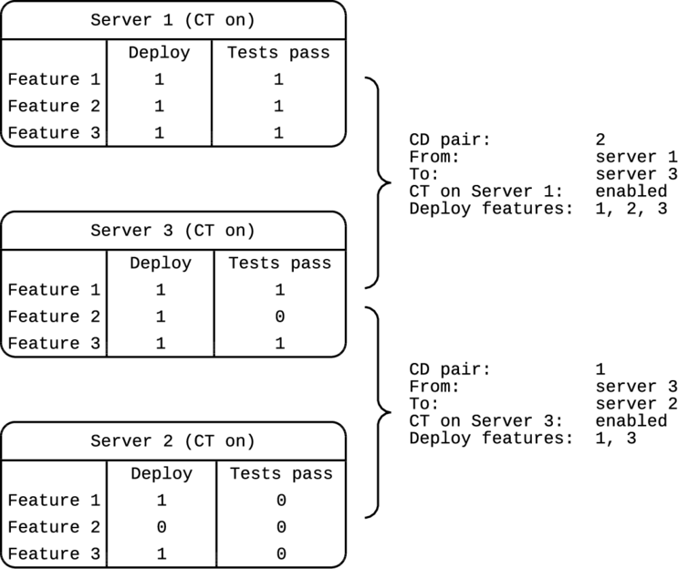

<h1 style='text-align: center;'> D. DevOps Best Practices</h1>

<h5 style='text-align: center;'>time limit per test: 3 seconds</h5>
<h5 style='text-align: center;'>memory limit per test: 512 megabytes</h5>

Daisy is a senior software engineer at RainyDay, LLC. She has just implemented three new features in their product: the first feature makes their product work, the second one makes their product fast, and the third one makes their product correct. The company encourages at least some testing of new features, so Daisy appointed her intern Demid to write some tests for the new features.

Interestingly enough, these three features pass all the tests on Demid's development server, which has index 1, but might fail the tests on some other servers.

After Demid has completed this task, Daisy appointed you to deploy these three features to all $n$ servers of your company. For every feature $f$ and every server $s$, Daisy told you whether she wants the feature $f$ to be deployed on the server $s$. If she wants it to be deployed, it must be done even if the feature $f$ fails the tests on the server $s$. If she does not want it to be deployed, you may not deploy it there.

Your company has two important instruments for the deployment of new features to servers: Continuous Deployment (CD) and Continuous Testing (CT). CD can be established between several pairs of servers, forming a directed graph. CT can be set up on some set of servers.

If CD is configured from the server $s_1$ to the server $s_2$ then every time $s_1$ receives a new feature $f$ the system starts the following deployment process of $f$ to $s_2$:

* If the feature $f$ is already deployed on the server $s_2$, then nothing is done.
* Otherwise, if CT is not set up on the server $s_1$, then the server $s_1$ just deploys the feature $f$ to the server $s_2$ without any testing.
* Otherwise, the server $s_1$ runs tests for the feature $f$. If the tests fail on the server $s_1$, nothing is done. If the tests pass, then the server $s_1$ deploys the feature $f$ to the server $s_2$.

You are to configure the CD/CT system, and after that Demid will deploy all three features on his development server. Your CD/CT system must deploy each feature exactly to the set of servers that Daisy wants.

Your company does not have a lot of computing resources, so you can establish CD from one server to another at most $264$ times.

## Input

The first line contains integer $n$ ($2 \le n \le 256$) — the number of servers in your company.

Next $n$ lines contain three integers each. The $j$-th integer in the $i$-th line is $1$ if Daisy wants the $j$-th feature to be deployed to the $i$-th server, or $0$ otherwise.

Next $n$ lines contain three integers each. The $j$-th integer in the $i$-th line is $1$ if tests pass for the $j$-th feature on the $i$-th server, or $0$ otherwise.

Demid's development server has index $1$. It is guaranteed that Daisy wants all three features to be deployed to the server number 1, and all three features pass their tests on the server number 1.

## Output

If it is impossible to configure CD/CT system with CD being set up between at most $264$ pairs of servers, then output the single line "Impossible".

Otherwise, the first line of the output must contain the line "Possible".

Next line must contain $n$ space-separated integers — the configuration of CT. The $i$-th integer should be $1$ if you set up CT on the $i$-th server, or $0$ otherwise.

Next line must contain the integer $m$ ($0 \le m \le 264$) — the number of CD pairs you want to set up.

Each of the next $m$ lines must describe CD configuration, each line with two integers $s_i$ and $t_i$ ($1 \le s_i, t_i \le n$; $s_i \ne t_i$), establishing automated deployment of new features from the server $s_i$ to the server $t_i$.

## Examples

## Input


```

3
1 1 1
1 0 1
1 1 1
1 1 1
0 0 0
1 0 1

```
## Output


```

Possible
1 1 1
2
3 2
1 3

```
## Input


```

2
1 1 1
0 0 1
1 1 1
1 1 0

```
## Output


```

Impossible

```
## Note

CD/CT system for the first sample test is shown below.

  

#### tags 

#2800 #constructive_algorithms 