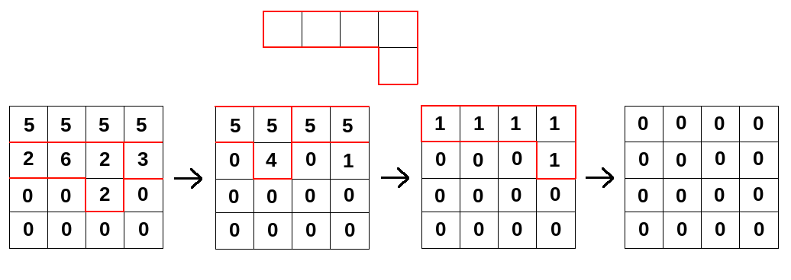

<h1 style='text-align: center;'> I. Xor on Figures</h1>

<h5 style='text-align: center;'>time limit per test: 5 seconds</h5>
<h5 style='text-align: center;'>memory limit per test: 256 megabytes</h5>

There is given an integer $k$ and a grid $2^k \times 2^k$ with some numbers written in its cells, cell $(i, j)$ initially contains number $a_{ij}$. Grid is considered to be a torus, that is, the cell to the right of $(i, 2^k)$ is $(i, 1)$, the cell below the $(2^k, i)$ is $(1, i)$ There is also given a lattice figure $F$, consisting of $t$ cells, where $t$ is odd. $F$ doesn't have to be connected.

We can perform the following operation: place $F$ at some position on the grid. (Only translations are allowed, rotations and reflections are prohibited). Now choose any nonnegative integer $p$. After that, for each cell $(i, j)$, covered by $F$, replace $a_{ij}$ by $a_{ij}\oplus p$, where $\oplus$ denotes the [bitwise XOR operation](https://en.wikipedia.org/wiki/Bitwise_operation#XOR).

More formally, let $F$ be given by cells $(x_1, y_1), (x_2, y_2), \dots, (x_t, y_t)$. Then you can do the following operation: choose any $x, y$ with $1\le x, y \le 2^k$, any nonnegative integer $p$, and for every $i$ from $1$ to $n$ replace number in the cell $(((x + x_i - 1)\bmod 2^k) + 1, ((y + y_i - 1)\bmod 2^k) + 1)$ with $a_{((x + x_i - 1)\bmod 2^k) + 1, ((y + y_i - 1)\bmod 2^k) + 1}\oplus p$.

Our goal is to make all the numbers equal to $0$. Can we achieve it? If we can, find the smallest number of operations in which it is possible to do this.

## Input

The first line contains a single integer $k$ ($1 \le k \le 9$).

The $i$-th of the next $2^k$ lines contains $2^k$ integers $a_{i1}, a_{i2}, \dots, a_{i2^k}$ ($0 \le a_{ij} < 2^{60}$) — initial values in the $i$-th row of the grid.

The next line contains a single integer $t$ ($1\le t \le \min(99, 4^k)$, $t$ is odd) — number of cells of figure.

$i$-th of next $t$ lines contains two integers $x_i$ and $y_i$ ($1 \le x_i, y_i \le 2^k$), describing the position of the $i$-th cell of the figure.

It is guaranteed that all cells are different, but it is not guaranteed that the figure is connected. 

## Output

If it is impossible to make all numbers in the grid equal to $0$ with these operations, output $-1$.

Otherwise, output a single integer — the minimal number of operations needed to do this. It can be shown that if it is possible to make all numbers equal $0$, it is possible to do so in less than $10^{18}$ operations.

## Example

## Input


```

2
5 5 5 5
2 6 2 3
0 0 2 0
0 0 0 0
5
1 1
1 2
1 3
1 4
2 4

```
## Output


```

3
```
## Note

The figure and the operations for the example are shown above:

  

#### tags 

#3500 #constructive_algorithms #fft #math 