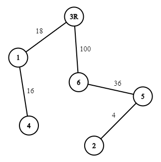

<h1 style='text-align: center;'> F. DIY Garland</h1>

<h5 style='text-align: center;'>time limit per test: 2 seconds</h5>
<h5 style='text-align: center;'>memory limit per test: 256 megabytes</h5>

Polycarp has decided to decorate his room because the New Year is soon. One of the main decorations that Polycarp will install is the garland he is going to solder himself.

Simple garlands consisting of several lamps connected by one wire are too boring for Polycarp. He is going to solder a garland consisting of $n$ lamps and $n - 1$ wires. Exactly one lamp will be connected to power grid, and power will be transmitted from it to other lamps by the wires. Each wire connectes exactly two lamps; one lamp is called the main lamp for this wire (the one that gets power from some other wire and transmits it to this wire), the other one is called the auxiliary lamp (the one that gets power from this wire). Obviously, each lamp has at most one wire that brings power to it (and this lamp is the auxiliary lamp for this wire, and the main lamp for all other wires connected directly to it).

Each lamp has a brightness value associated with it, the $i$-th lamp has brightness $2^i$. We define the importance of the wire as the sum of brightness values over all lamps that become disconnected from the grid if the wire is cut (and all other wires are still working).

Polycarp has drawn the scheme of the garland he wants to make (the scheme depicts all $n$ lamp and $n - 1$ wires, and the lamp that will be connected directly to the grid is marked; the wires are placed in such a way that the power can be transmitted to each lamp). After that, Polycarp calculated the importance of each wire, enumerated them from $1$ to $n - 1$ in descending order of their importance, and then wrote the index of the main lamp for each wire (in the order from the first wire to the last one).

The following day Polycarp bought all required components of the garland and decided to solder it — but he could not find the scheme. Fortunately, Polycarp found the list of indices of main lamps for all wires. Can you help him restore the original scheme?

## Input

The first line contains one integer $n$ ($2 \le n \le 2 \cdot 10^5$) — the number of lamps.

The second line contains $n - 1$ integers $a_1$, $a_2$, ..., $a_{n - 1}$ ($1 \le a_i \le n$), where $a_i$ is the index of the main lamp for the $i$-th wire (wires are numbered in descending order of importance).

## Output

If it is impossible to restore the original scheme, print one integer $-1$.

Otherwise print the scheme as follows. In the first line, print one integer $k$ ($1 \le k \le n$) — the index of the lamp that is connected to the power grid. Then print $n - 1$ lines, each containing two integers $x_i$ and $y_i$ ($1 \le x_i, y_i \le n$, $x_i \ne y_i$) — the indices of the lamps connected by some wire. The descriptions of the wires (and the lamps connected by a wire) can be printed in any order. The printed description must correspond to a scheme of a garland such that Polycarp could have written the list $a_1$, $a_2$, ..., $a_{n - 1}$ from it. If there are multiple such schemes, output any of them.

## Example

## Input


```

6
3 6 3 1 5

```
## Output


```

3
6 3
6 5
1 3
1 4
5 2

```
## Note

The scheme for the first example (R denotes the lamp connected to the grid, the numbers on wires are their importance values):




#### tags 

#2200 #constructive_algorithms #greedy #trees 