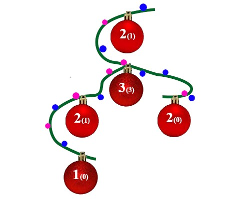

<h1 style='text-align: center;'> B. Numbers on Tree</h1>

<h5 style='text-align: center;'>time limit per test: 1 second</h5>
<h5 style='text-align: center;'>memory limit per test: 256 megabytes</h5>

Evlampiy was gifted a rooted tree. The vertices of the tree are numbered from $1$ to $n$. Each of its vertices also has an integer $a_i$ written on it. For each vertex $i$, Evlampiy calculated $c_i$ — the number of vertices $j$ in the subtree of vertex $i$, such that $a_j < a_i$. 

Illustration for the second example, the first integer is $a_i$ and the integer in parentheses is $c_i$After the new year, Evlampiy could not remember what his gift was! He remembers the tree and the values of $c_i$, but he completely forgot which integers $a_i$ were written on the vertices.

Help him to restore initial integers!

## Input

The first line contains an integer $n$ $(1 \leq n \leq 2000)$ — the number of vertices in the tree.

The next $n$ lines contain descriptions of vertices: the $i$-th line contains two integers $p_i$ and $c_i$ ($0 \leq p_i \leq n$; $0 \leq c_i \leq n-1$), where $p_i$ is the parent of vertex $i$ or $0$ if vertex $i$ is root, and $c_i$ is the number of vertices $j$ in the subtree of vertex $i$, such that $a_j < a_i$.

It is guaranteed that the values of $p_i$ describe a rooted tree with $n$ vertices.

## Output

If a solution exists, in the first line print "YES", and in the second line output $n$ integers $a_i$ $(1 \leq a_i \leq {10}^{9})$. If there are several solutions, output any of them. One can prove that if there is a solution, then there is also a solution in which all $a_i$ are between $1$ and $10^9$.

If there are no solutions, print "NO".

## Examples

## Input


```

3
2 0
0 2
2 0

```
## Output


```

YES
1 2 1 
```
## Input


```

5
0 1
1 3
2 1
3 0
2 0

```
## Output


```

YES
2 3 2 1 2

```


#### tags 

#1800 #constructive_algorithms #data_structures #dfs_and_similar #graphs #greedy #trees 