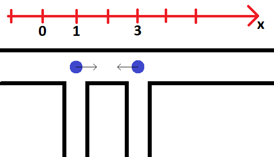

<h1 style='text-align: center;'> D. LCC</h1>

<h5 style='text-align: center;'>time limit per test: 2 seconds</h5>
<h5 style='text-align: center;'>memory limit per test: 256 megabytes</h5>

An infinitely long Line Chillland Collider (LCC) was built in Chillland. There are $n$ pipes with coordinates $x_i$ that are connected to LCC. When the experiment starts at time 0, $i$-th proton flies from the $i$-th pipe with speed $v_i$. It flies to the right with probability $p_i$ and flies to the left with probability $(1 - p_i)$. The duration of the experiment is determined as the time of the first collision of any two protons. In case there is no collision, the duration of the experiment is considered to be zero.

Find the expected value of the duration of the experiment.

Illustration for the first example## Input

The first line of input contains one integer $n$ — the number of pipes ($1 \le n \le 10^5$). Each of the following $n$ lines contains three integers $x_i$, $v_i$, $p_i$ — the coordinate of the $i$-th pipe, the speed of the $i$-th proton and the probability that the $i$-th proton flies to the right in percentage points ($-10^9 \le x_i \le 10^9, 1 \le v \le 10^6, 0 \le p_i \le 100$). It is guaranteed that all $x_i$ are distinct and sorted in increasing order.

## Output

It's possible to prove that the answer can always be represented as a fraction $P/Q$, where $P$ is an integer and $Q$ is a natural number not divisible by $998\,244\,353$. In this case, print $P \cdot Q^{-1}$ modulo $998\,244\,353$.

## Examples

## Input


```

2
1 1 100
3 1 0

```
## Output


```

1

```
## Input


```

3
7 10 0
9 4 86
14 5 100

```
## Output


```

0

```
## Input


```

4
6 4 50
11 25 50
13 16 50
15 8 50

```
## Output


```

150902884

```


#### tags 

#3100 #data_structures #math #matrices #probabilities 