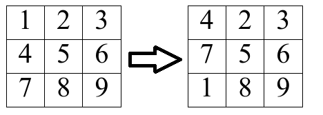
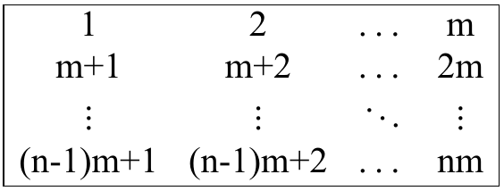

<h1 style='text-align: center;'> E. Obtain a Permutation</h1>

<h5 style='text-align: center;'>time limit per test: 2 seconds</h5>
<h5 style='text-align: center;'>memory limit per test: 256 megabytes</h5>

You are given a rectangular matrix of size $n \times m$ consisting of integers from $1$ to $2 \cdot 10^5$.

In one move, you can:

* choose any element of the matrix and change its value to any integer between $1$ and $n \cdot m$, inclusive;
* take any column and shift it one cell up cyclically (see the example of such cyclic shift below).

A cyclic shift is an operation such that you choose some $j$ ($1 \le j \le m$) and set $a_{1, j} := a_{2, j}, a_{2, j} := a_{3, j}, \dots, a_{n, j} := a_{1, j}$ simultaneously.

  Example of cyclic shift of the first column You want to perform the minimum number of moves to make this matrix look like this:

  In other words, the goal is to obtain the matrix, where $a_{1, 1} = 1, a_{1, 2} = 2, \dots, a_{1, m} = m, a_{2, 1} = m + 1, a_{2, 2} = m + 2, \dots, a_{n, m} = n \cdot m$ (i.e. $a_{i, j} = (i - 1) \cdot m + j$) with the minimum number of moves performed.

## Input

The first line of the input contains two integers $n$ and $m$ ($1 \le n, m \le 2 \cdot 10^5, n \cdot m \le 2 \cdot 10^5$) — the size of the matrix.

The next $n$ lines contain $m$ integers each. The number at the line $i$ and position $j$ is $a_{i, j}$ ($1 \le a_{i, j} \le 2 \cdot 10^5$).

## Output

Print one integer — the minimum number of moves required to obtain the matrix, where $a_{1, 1} = 1, a_{1, 2} = 2, \dots, a_{1, m} = m, a_{2, 1} = m + 1, a_{2, 2} = m + 2, \dots, a_{n, m} = n \cdot m$ ($a_{i, j} = (i - 1)m + j$).

## Examples

## Input


```

3 3
3 2 1
1 2 3
4 5 6

```
## Output


```

6

```
## Input


```

4 3
1 2 3
4 5 6
7 8 9
10 11 12

```
## Output


```

0

```
## Input


```

3 4
1 6 3 4
5 10 7 8
9 2 11 12

```
## Output


```

2

```
## Note

In the first example, you can set $a_{1, 1} := 7, a_{1, 2} := 8$ and $a_{1, 3} := 9$ then shift the first, the second and the third columns cyclically, so the answer is $6$. It can be shown that you cannot achieve a better answer.

In the second example, the matrix is already good so the answer is $0$.

In the third example, it is enough to shift the second column cyclically twice to obtain a good matrix, so the answer is $2$.


#### tags 

#1900 #greedy #implementation #math 