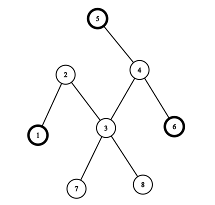

<h1 style='text-align: center;'> F. Three Paths on a Tree</h1>

<h5 style='text-align: center;'>time limit per test: 2 seconds</h5>
<h5 style='text-align: center;'>memory limit per test: 256 megabytes</h5>

You are given an unweighted tree with $n$ vertices. Recall that a tree is a connected undirected graph without cycles.

Your task is to choose three distinct vertices $a, b, c$ on this tree such that the number of edges which belong to at least one of the simple paths between $a$ and $b$, $b$ and $c$, or $a$ and $c$ is the maximum possible. See the notes section for a better understanding.

The simple path is the path that visits each vertex at most once.

## Input

The first line contains one integer number $n$ ($3 \le n \le 2 \cdot 10^5$) — the number of vertices in the tree. 

Next $n - 1$ lines describe the edges of the tree in form $a_i, b_i$ ($1 \le a_i$, $b_i \le n$, $a_i \ne b_i$). It is guaranteed that given graph is a tree.

## Output

In the first line print one integer $res$ — the maximum number of edges which belong to at least one of the simple paths between $a$ and $b$, $b$ and $c$, or $a$ and $c$.

In the second line print three integers $a, b, c$ such that $1 \le a, b, c \le n$ and $a \ne, b \ne c, a \ne c$.

If there are several answers, you can print any.

## Example

## Input


```

8
1 2
2 3
3 4
4 5
4 6
3 7
3 8

```
## Output


```

5
1 8 6

```
## Note

The picture corresponding to the first example (and another one correct answer):



If you choose vertices $1, 5, 6$ then the path between $1$ and $5$ consists of edges $(1, 2), (2, 3), (3, 4), (4, 5)$, the path between $1$ and $6$ consists of edges $(1, 2), (2, 3), (3, 4), (4, 6)$ and the path between $5$ and $6$ consists of edges $(4, 5), (4, 6)$. The union of these paths is $(1, 2), (2, 3), (3, 4), (4, 5), (4, 6)$ so the answer is $5$. It can be shown that there is no better answer.


#### tags 

#2000 #dfs_and_similar #dp #greedy #trees 