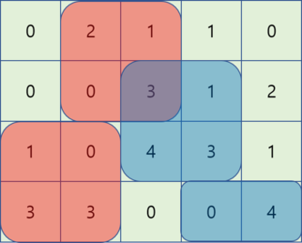
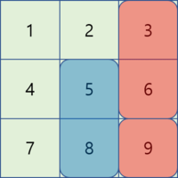
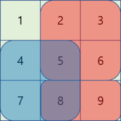
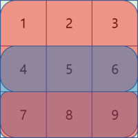

<h1 style='text-align: center;'> F1. Animal Observation (easy version)</h1>

<h5 style='text-align: center;'>time limit per test: 3 seconds</h5>
<h5 style='text-align: center;'>memory limit per test: 512 megabytes</h5>

The only difference between easy and hard versions is the constraint on $k$.

Gildong loves observing animals, so he bought two cameras to take videos of wild animals in a forest. The color of one camera is red, and the other one's color is blue.

Gildong is going to take videos for $n$ days, starting from day $1$ to day $n$. The forest can be divided into $m$ areas, numbered from $1$ to $m$. He'll use the cameras in the following way: 

* On every odd day ($1$-st, $3$-rd, $5$-th, ...), bring the red camera to the forest and record a video for $2$ days.
* On every even day ($2$-nd, $4$-th, $6$-th, ...), bring the blue camera to the forest and record a video for $2$ days.
* If he starts recording on the $n$-th day with one of the cameras, the camera records for only one day.

Each camera can observe $k$ consecutive areas of the forest. For example, if $m=5$ and $k=3$, he can put a camera to observe one of these three ranges of areas for two days: $[1,3]$, $[2,4]$, and $[3,5]$.

Gildong got information about how many animals will be seen in each area each day. Since he would like to observe as many animals as possible, he wants you to find the best way to place the two cameras for $n$ days. ## Note

 that if the two cameras are observing the same area on the same day, the animals observed in that area are counted only once.

## Input

The first line contains three integers $n$, $m$, and $k$ ($1 \le n \le 50$, $1 \le m \le 2 \cdot 10^4$, $1 \le k \le min(m,20)$) – the number of days Gildong is going to record, the number of areas of the forest, and the range of the cameras, respectively.

Next $n$ lines contain $m$ integers each. The $j$-th integer in the $i+1$-st line is the number of animals that can be seen on the $i$-th day in the $j$-th area. Each number of animals is between $0$ and $1000$, inclusive.

## Output

Print one integer – the maximum number of animals that can be observed.

## Examples

## Input


```

4 5 2
0 2 1 1 0
0 0 3 1 2
1 0 4 3 1
3 3 0 0 4

```
## Output


```

25

```
## Input


```

3 3 1
1 2 3
4 5 6
7 8 9

```
## Output


```

31

```
## Input


```

3 3 2
1 2 3
4 5 6
7 8 9

```
## Output


```

44

```
## Input


```

3 3 3
1 2 3
4 5 6
7 8 9

```
## Output


```

45

```
## Note

The optimal way to observe animals in the four examples are as follows:

Example 1: 

  Example 2: 

  Example 3: 

  Example 4: 

  

#### tags 

#2300 #data_structures #dp 