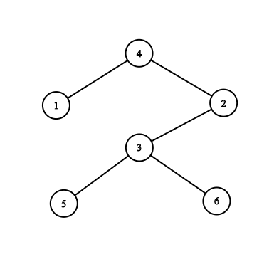

<h1 style='text-align: center;'> D. Kuroni and the Celebration</h1>

<h5 style='text-align: center;'>time limit per test: 1 second</h5>
<h5 style='text-align: center;'>memory limit per test: 256 megabytes</h5>

This is an interactive problem.

After getting AC after 13 Time Limit Exceeded verdicts on a geometry problem, Kuroni went to an Italian restaurant to celebrate this holy achievement. Unfortunately, the excess sauce disoriented him, and he's now lost!

The United States of America can be modeled as a tree (why though) with $n$ vertices. The tree is rooted at vertex $r$, wherein lies Kuroni's hotel.

Kuroni has a phone app designed to help him in such emergency cases. To use the app, he has to input two vertices $u$ and $v$, and it'll return a vertex $w$, which is the lowest common ancestor of those two vertices.

However, since the phone's battery has been almost drained out from live-streaming Kuroni's celebration party, he could only use the app at most $\lfloor \frac{n}{2} \rfloor$ times. After that, the phone would die and there will be nothing left to help our dear friend! :(

As the night is cold and dark, Kuroni needs to get back, so that he can reunite with his comfy bed and pillow(s). Can you help him figure out his hotel's location?

## Interaction

The interaction starts with reading a single integer $n$ ($2 \le n \le 1000$), the number of vertices of the tree.

Then you will read $n-1$ lines, the $i$-th of them has two integers $x_i$ and $y_i$ ($1 \le x_i, y_i \le n$, $x_i \ne y_i$), denoting there is an edge connecting vertices $x_i$ and $y_i$. It is guaranteed that the edges will form a tree.

Then you can make queries of type "? u v" ($1 \le u, v \le n$) to find the lowest common ancestor of vertex $u$ and $v$.

After the query, read the result $w$ as an integer.

In case your query is invalid or you asked more than $\lfloor \frac{n}{2} \rfloor$ queries, the program will print $-1$ and will finish interaction. You will receive a Wrong answer verdict. Make sure to exit immediately to avoid getting other verdicts.

When you find out the vertex $r$, print "! $r$" and quit after that. This query does not count towards the $\lfloor \frac{n}{2} \rfloor$ limit.

## Note

 that the tree is fixed beforehand and will not change during the queries, i.e. the interactor is not adaptive.

After printing any query do not forget to print end of line and flush the output. Otherwise, you might get Idleness limit exceeded. To do this, use:

* fflush(stdout) or cout.flush() in C++;
* System.out.flush() in Java;
* flush(output) in Pascal;
* stdout.flush() in Python;
* see the documentation for other languages.

Hacks

To hack, use the following format:

The first line should contain two integers $n$ and $r$ ($2 \le n \le 1000$, $1 \le r \le n$), denoting the number of vertices and the vertex with Kuroni's hotel.

The $i$-th of the next $n-1$ lines should contain two integers $x_i$ and $y_i$ ($1 \le x_i, y_i \le n$) — denoting there is an edge connecting vertex $x_i$ and $y_i$.

The edges presented should form a tree.

## Example

Input
```

6
1 4
4 2
5 3
6 3
2 3

3

4

4


```
Output
```


? 5 6

? 3 1

? 1 2

! 4
```
## Note

## Note

 that the example interaction contains extra empty lines so that it's easier to read. The real interaction doesn't contain any empty lines and you shouldn't print any extra empty lines as well.

The image below demonstrates the tree in the sample test:




#### tags 

#1900 #constructive_algorithms #dfs_and_similar #interactive #trees 