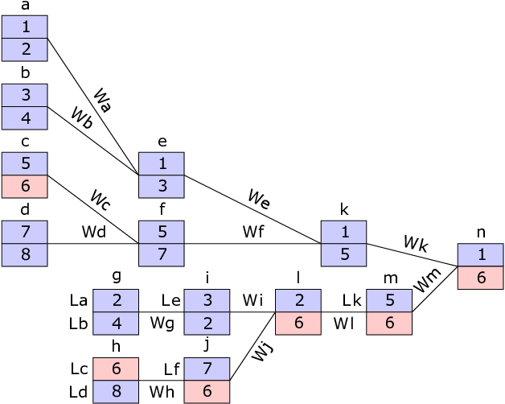
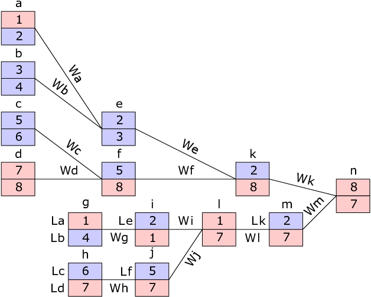

<h1 style='text-align: center;'> B. Double Elimination</h1>

<h5 style='text-align: center;'>time limit per test: 2 seconds</h5>
<h5 style='text-align: center;'>memory limit per test: 512 megabytes</h5>

The biggest event of the year – Cota 2 world championship "The Innernational" is right around the corner. $2^n$ teams will compete in a double-elimination format (please, carefully read problem statement even if you know what is it) to identify the champion. 

Teams are numbered from $1$ to $2^n$ and will play games one-on-one. All teams start in the upper bracket.

All upper bracket matches will be held played between teams that haven't lost any games yet. Teams are split into games by team numbers. Game winner advances in the next round of upper bracket, losers drop into the lower bracket.

Lower bracket starts with $2^{n-1}$ teams that lost the first upper bracket game. Each lower bracket round consists of two games. In the first game of a round $2^k$ teams play a game with each other (teams are split into games by team numbers). $2^{k-1}$ loosing teams are eliminated from the championship, $2^{k-1}$ winning teams are playing $2^{k-1}$ teams that got eliminated in this round of upper bracket (again, teams are split into games by team numbers). As a result of each round both upper and lower bracket have $2^{k-1}$ teams remaining. See example notes for better understanding.

Single remaining team of upper bracket plays with single remaining team of lower bracket in grand-finals to identify championship winner.

You are a fan of teams with numbers $a_1, a_2, ..., a_k$. You want the championship to have as many games with your favourite teams as possible. Luckily, you can affect results of every championship game the way you want. What's maximal possible number of championship games that include teams you're fan of?

## Input

First input line has two integers $n, k$ — $2^n$ teams are competing in the championship. You are a fan of $k$ teams ($2 \le n \le 17; 0 \le k \le 2^n$).

Second input line has $k$ distinct integers $a_1, \ldots, a_k$ — numbers of teams you're a fan of ($1 \le a_i \le 2^n$).

## Output

## Output

 single integer — maximal possible number of championship games that include teams you're fan of.

## Examples

## Input


```

3 1
6

```
## Output


```

6

```
## Input


```

3 3
1 7 8

```
## Output


```

11

```
## Input


```

3 4
1 3 5 7

```
## Output


```

14

```
## Note

On the image, each game of the championship is denoted with an English letter ($a$ to $n$). Winner of game $i$ is denoted as $Wi$, loser is denoted as $Li$. Teams you're a fan of are highlighted with red background.

In the first example, team $6$ will play in 6 games if it looses the first upper bracket game (game $c$) and wins all lower bracket games (games $h, j, l, m$). 

In the second example, teams $7$ and $8$ have to play with each other in the first game of upper bracket (game $d$). Team $8$ can win all remaining games in upper bracket, when teams $1$ and $7$ will compete in the lower bracket. 

In the third example, your favourite teams can play in all games of the championship. 


#### tags 

#2500 #dp #implementation 